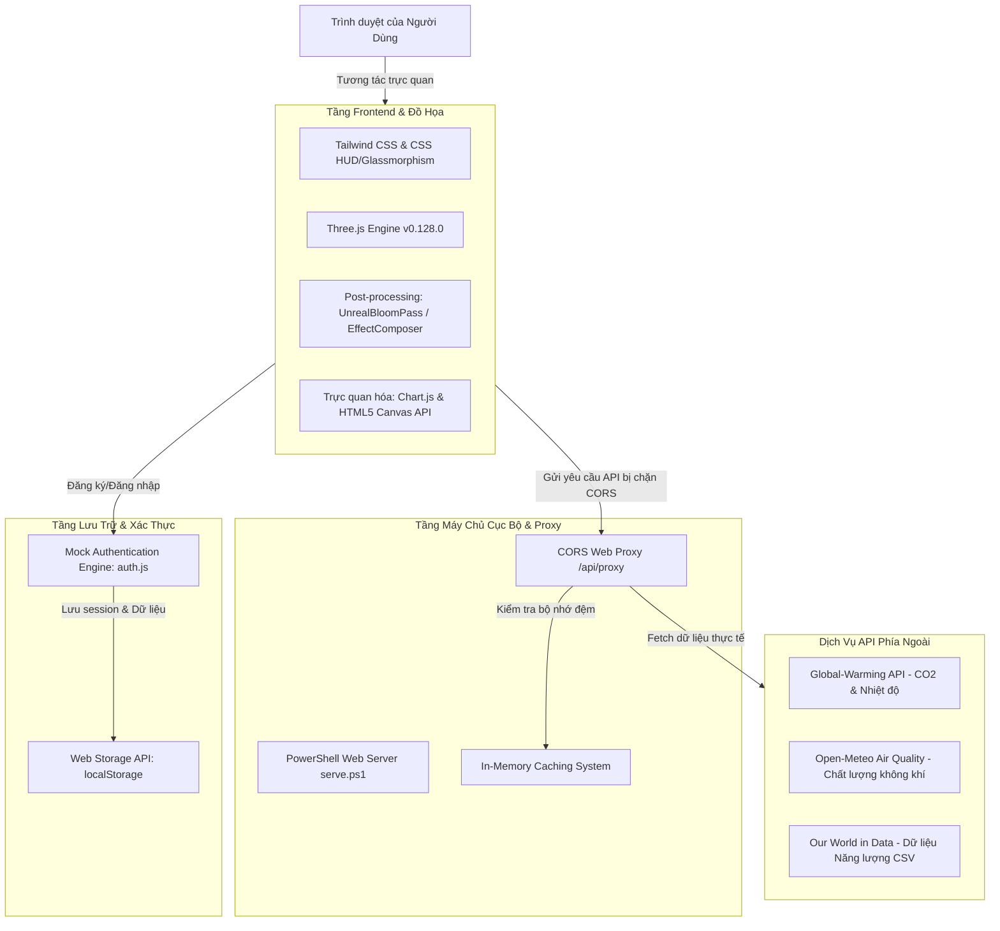

# 🌿 Báo Cáo Công Nghệ Sử Dụng trong EcoImpact

Tài liệu này cung cấp một cái nhìn chi tiết và đầy đủ nhất về các công nghệ, thư viện, API và giải pháp kỹ thuật được áp dụng trong nền tảng Web tương tác bảo vệ môi trường **EcoImpact** (*EcoImpact Hero*).

---

## 🗺️ Bản Đồ Kiến Trúc Tổng Quan

Dự án được tối ưu hóa chạy trực tiếp ở phía client (Client-side Rendering) cùng với một máy chủ cục bộ trung gian đóng vai trò hỗ trợ phân phối tài nguyên và giải quyết các giới hạn bảo mật mạng.

---

## 1. Đồ Họa 3D Tương Tác (WebGL & Real-Time 3D)

Để thu hút người dùng ngay từ cái nhìn đầu tiên, dự án sử dụng nền đồ họa 3D động hoạt động mượt mà trực tiếp trên trình duyệt web thông qua các thư viện WebGL mạnh mẽ:

| Tên Công Nghệ | Vai Trò & Chức Năng | Tệp Tin Liên Quan |
| :--- | :--- | :--- |
| **Three.js (v0.128.0)** | Thư viện chính tạo lập bối cảnh 3D full-screen, quản lý camera, ánh sáng và quá trình vẽ khung cảnh lên màn hình. | [bg3d.js](file:///c:/Users/ACER/Downloads/CNW/bwd/js/bg3d.js) |
| **GLTFLoader** | Tải và xử lý các mô hình 3D nén hiệu năng cao (`.glb`). | [bg3d.js](file:///c:/Users/ACER/Downloads/CNW/bwd/js/bg3d.js) |
| **OrbitControls** | Cho phép người dùng dùng chuột/tay để xoay, thu phóng và điều hướng camera xung quanh Trái Đất 3D. | [bg3d.js](file:///c:/Users/ACER/Downloads/CNW/bwd/js/bg3d.js) |

### Kỹ Thuật Xử Lý Hình Ảnh Cao Cấp:
1. **Three.js Post-processing:**
   * Sử dụng `EffectComposer` phối hợp với `RenderPass` để tạo bộ lọc hình ảnh nhiều lớp.
   * Sử dụng `UnrealBloomPass` và `LuminosityHighPassShader` tạo hiệu ứng phát quang rực rỡ neon (Bloom/Glow) huyền ảo cho lá cây, tầng khí quyển và chi tiết máy HUD.
2. **Hệ Thống Hạt (Particle Systems) Mô Phỏng Môi Trường:**
   * **Hạt mưa giông (`rainParticles`):** Vẽ vệt nước nghiêng bằng `CanvasTexture` với hơn **4,000 hạt mưa** rơi nhanh và gió giật mạnh.
   * **Bụi mịn ô nhiễm (`fineDustParticles`):** Hơn **3,000 hạt bụi** siêu nhỏ PM2.5 màu xám đục trôi dạt vô định tạo không khí ô nhiễm.
   * **Bụi tàn tro / Bụi đất (`sootParticles` & `debrisParticles`):** Các mảnh bụi vụn cacbon đen rụng rơi chậm rãi phản ánh sự biến đổi khí hậu.
3. **Hệ Thống Sinh Trưởng Động (Ecosystem Reviving):**
   * **Thảm cỏ động (`grassGroup`):** Gồm **1,500 ngọn cỏ** cấu thành từ `PlaneGeometry`, được uốn cong theo định luật parabol và xoắn ngọn tự nhiên bằng công thức lượng giác trong JS.
   * **Hoa dại nở rộ (`flowerGroup`):** **45 bông hoa** dại với các màu Hồng, Cam, Trắng mọc ngẫu nhiên quanh gốc cây.
   * *Cơ chế hoạt động:* Chiều cao thảm cỏ tăng trưởng động từ $0$ đến $1$ (mọc thẳng lên) tùy thuộc vào kết quả tính toán giảm phát thải CO₂ cá nhân của người dùng.

---

## 2. Thiết Kế & Giao Diện Người Dùng (UI/UX Styling)

Giao diện của **EcoImpact** được kết hợp giữa phong cách khoa học viễn tưởng **Futuristic HUD** (Heads-Up Display) và hiệu ứng thị giác **Glassmorphism** cực kỳ hiện đại.

*   **Tailwind CSS (CDN):**
    *   Cung cấp hệ thống CSS tiện ích giúp phân chia lưới giao diện cấu trúc **Bento Grid**, căn chỉnh Flexbox và điều phối màu sắc đồng bộ, tối ưu hóa giao diện hiển thị tốt trên tất cả các loại màn hình (Responsive).
*   **Vanilla CSS (`styles.css` & `login.css`):**
    *   **Hiệu ứng kính mờ (Glassmorphism):** Dùng `backdrop-filter: blur(18px)` kết hợp với viền trắng bán trong suốt để tạo ra các bảng điều khiển dạng kính cao cấp bay lơ lửng trên không gian vũ trụ 3D.
    *   **Giao diện HUD viễn tưởng:** Tùy biến các góc bo cơ khí công nghệ cao, đèn tín hiệu trạng thái nhấp nháy (`Pulse dots`), và các đường lưới đo đạc (`Grid overlay`) giả lập trung tâm khí hậu.
    *   **Hiệu ứng chuyển động (CSS Keyframes):** Tạo hiệu ứng chớp sấm sét động, màn hình chờ tải nhẹ nhàng tắt dần (`fade-out`), và các hiệu ứng phóng to/thu nhỏ tinh tế khi rê chuột qua các nút bấm.
*   **Google Fonts:**
    *   `Fraunces`: Font chữ serif mang tính biểu cảm cao, được dùng làm tiêu đề chính mang tính giáo dục, kêu gọi.
    *   `Be Vietnam Pro`: Font chữ sans-serif hình khối sắc nét, dễ đọc, phù hợp cho các dữ liệu số học kỹ thuật và bảng tin.

---

## 3. Biểu Đồ & Trực Quan Hóa Dữ Liệu (Data Visualization)

*   **Chart.js:**
    *   Được tích hợp ở trang thống kê [dashboard.html](file:///c:/Users/ACER/Downloads/CNW/bwd/dashboard.html).
    *   *Biểu đồ đường (Line Chart):* Thể hiện xu hướng biến đổi nồng độ CO₂ khí quyển qua các tháng trong năm với đường cong mềm mại (`tension: 0.42`) kèm hiệu ứng tô màu gradient bên dưới.
    *   *Biểu đồ cột (Bar Chart):* So sánh nhiệt độ đo được trực tiếp giữa 5 châu lục bằng các cột dọc bo góc tròn sang trọng và màu sắc HUD hài hòa.
*   **HTML5 Canvas API:**
    *   Dùng để tự vẽ biểu đồ thu nhỏ dạng dòng kẻ (**Sparklines**) màu xanh lá trên trang chủ.
    *   Kỹ thuật này giúp vẽ trực tiếp đồ thị lên bộ đệm trình duyệt mà không cần tải thêm các thư viện biểu đồ nặng nề bên thứ ba, giảm thời gian render ban đầu về dưới **50ms**.

---

## 4. Tích Hợp Dữ Liệu Thời Gian Thực (APIs & Datasets)

Dự án không dùng dữ liệu giả định tĩnh mà tích hợp dữ liệu trực tiếp từ các trạm khí tượng và trung tâm khoa học vũ trụ thực tế:

1.  **Global-Warming API:**
    *   Truy vấn nồng độ CO₂ hiện tại của Trái Đất thông qua đường dẫn `https://global-warming.org/api/co2-api`.
    *   Truy vấn mức độ thay đổi nhiệt độ toàn cầu qua `https://global-warming.org/api/temperature-api` (so với mốc chuẩn 14.0°C thời tiền công nghiệp).
2.  **Open-Meteo Air Quality API:**
    *   Dự báo chỉ số chất lượng không khí châu Âu (AQI), nồng độ các hạt bụi siêu mịn PM2.5 và PM10 theo tọa độ vĩ độ và kinh độ địa lý của trạm đo đạc.
3.  **RestCountries API:**
    *   Cung cấp dữ liệu địa lý quốc gia, tên bản địa hóa tiếng Việt để phân nhóm các thủ đô theo châu lục trên bản đồ nhiệt độ toàn cầu.
4.  **Our World in Data (OWID) - Dữ Liệu Năng Lượng Tái Tạo:**
    *   Trình duyệt tự tải trực tiếp các tệp tin CSV thực tế gồm sản lượng điện năng toàn cầu (`electricity-generation.csv`) và tỷ lệ điện năng tái tạo (`share-electricity-renewables.csv`).
    *   Mã nguồn JavaScript xử lý việc đọc và bóc tách cấu trúc cột dữ liệu CSV ngay tại Client để hiển thị lịch sử phát triển năng lượng xanh và quy đổi sang chỉ số TWh tương đương.

---

## 5. Xác Thực & Lưu Trữ Phía Client (State Management & Auth)

Dự án hoạt động theo mô hình **Serverless Database** đối với dữ liệu người dùng để thuận tiện cho việc chạy demo offline mà vẫn đảm bảo tính bảo mật và trải nghiệm đầy đủ:

*   **Web Storage API (localStorage):**
    *   Được tận dụng để làm "cơ sở dữ liệu cục bộ".
    *   Lưu thông tin đăng ký tài khoản, lịch sử tính toán lượng phát thải CO₂ cá nhân gần nhất, và phiên đăng nhập (session) của tài khoản hiện tại.
*   **Mock Authentication Engine (`MockAuth`):**
    *   Được cài đặt trong tệp [auth.js](file:///c:/Users/ACER/Downloads/CNW/bwd/auth.js).
    *   Xây dựng luồng đăng ký, đăng nhập kiểm tra mật khẩu trùng khớp, tự động cài tài khoản kiểm thử mặc định (`admin1122@gmail.com` / `123456`).
    *   **Quá trình Quên mật khẩu đa bước:** Mô phỏng sinh mã OTP 6 chữ số (`123456`), cơ chế đếm ngược thời gian gửi lại mã OTP (cooldown 30s) và cập nhật mật khẩu mới vào cơ sở dữ liệu `localStorage`.

---

## 6. Máy Chủ Cục Bộ & Proxy Vượt Rào CORS (PowerShell Backend)

Để giải quyết vấn đề bảo mật mạng của trình duyệt ngăn chặn JavaScript tải tài nguyên trực tiếp giữa các máy chủ khác miền (Cross-Origin Resource Sharing - CORS), dự án cung cấp một file kịch bản chạy máy chủ:

*   **PowerShell HTTP Listener Web Server (`serve.ps1`):**
    *   **Tạo Static File Server:** Phân phối các tệp tin HTML, CSS, JS, hình ảnh và đặc biệt là tệp mô hình 3D nặng `.glb` (với đúng Header `Content-Type: model/gltf-binary`) qua cổng cục bộ `http://localhost:8000/`.
    *   **CORS Proxy:** Triển khai một endpoint trung gian `/api/proxy?url=...`. Khi frontend cần gọi một API ngoài bị chặn CORS, yêu cầu sẽ được chuyển tới `/api/proxy`. Máy chủ PowerShell sẽ dùng câu lệnh `Invoke-WebRequest` phía backend để lấy hộ dữ liệu đó về và truyền lại cho trình duyệt.
    *   **Hệ Thống Cache Cục Bộ (In-Memory Cache):** Đi kèm cơ chế lưu trữ đệm trong bộ nhớ RAM của PowerShell với thời gian sống cấu hình (TTL - Mặc định 5 phút). Khi có nhiều yêu cầu gửi tới cùng một URL API, proxy sẽ trả ngay kết quả đã cache mà không cần truy vấn mạng lại, giúp trang web phản hồi siêu tốc và tránh vượt quá hạn định (rate limits) của nhà cung cấp API.

---

🌿 *Tất cả các công nghệ trên được liên kết chặt chẽ với nhau để tạo nên một EcoImpact sống động, trực quan và ý nghĩa.*
