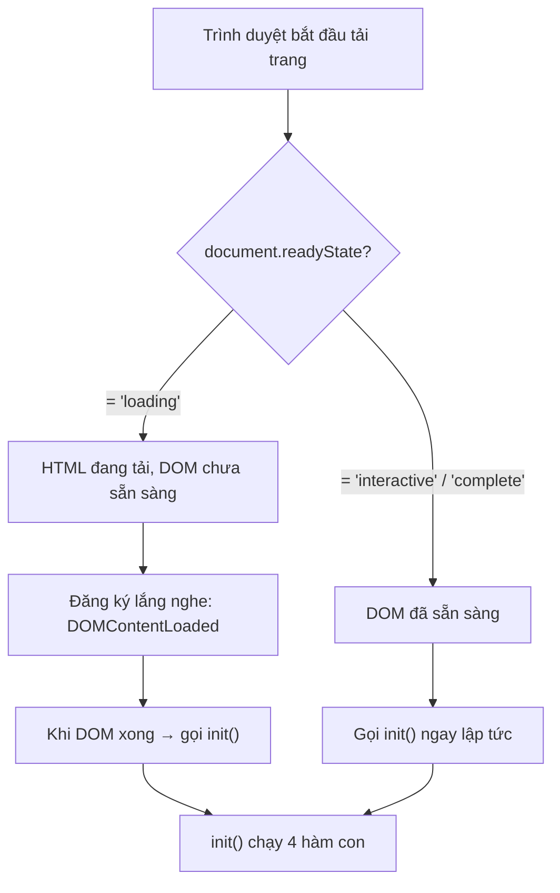
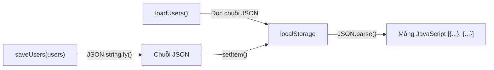
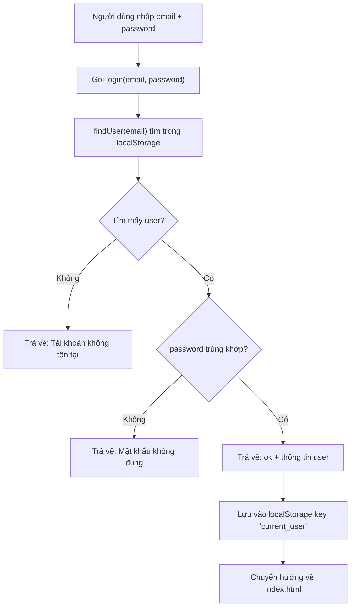
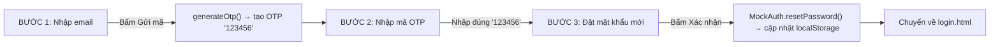
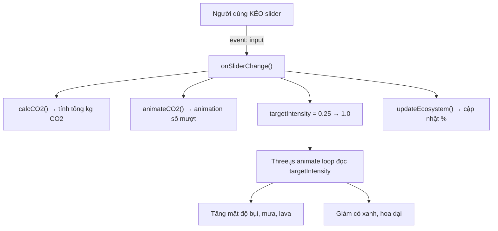
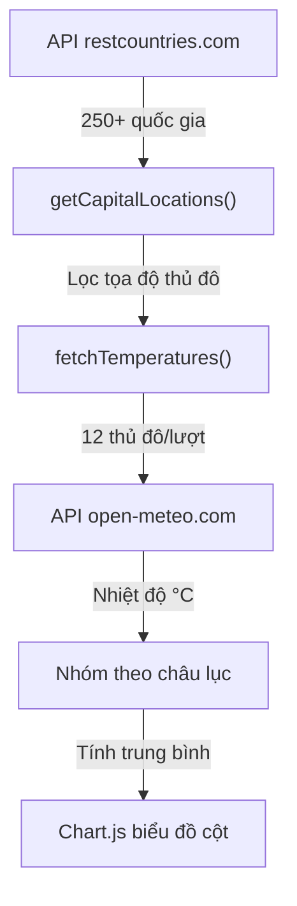
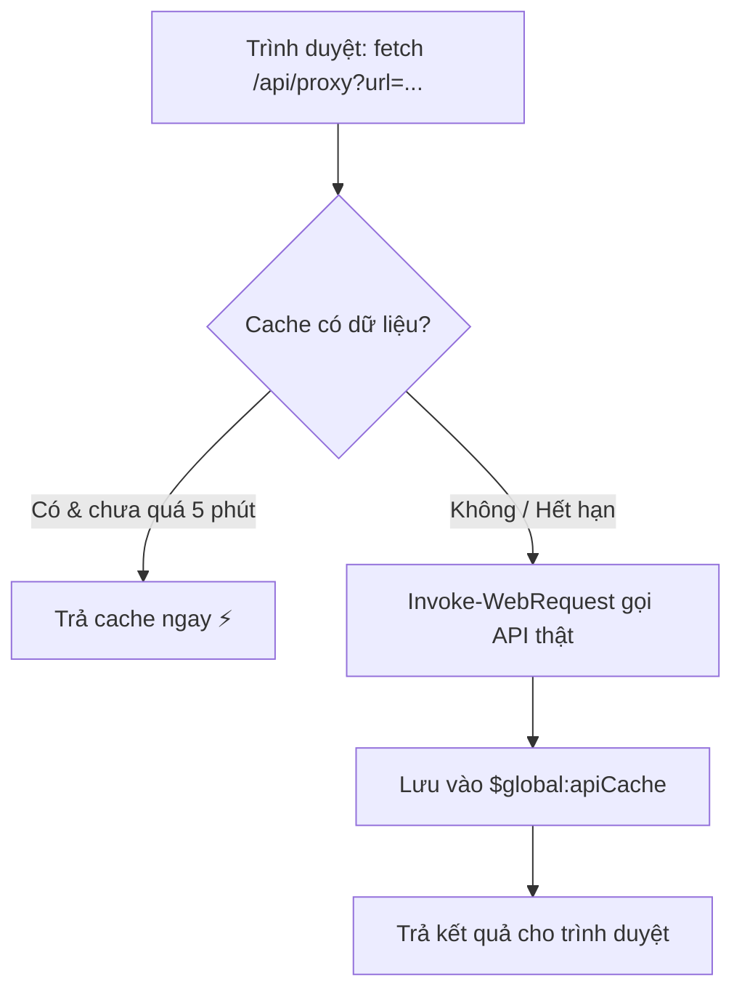
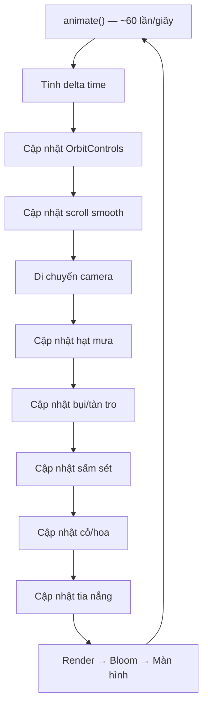
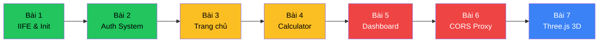

# 📖 HƯỚNG DẪN HỌC CODE CHI TIẾT — ECOIMPACT HERO
> **Đọc từng đoạn, hiểu từng dòng — Từ zero đến hero 🚀**
>
> Tài liệu này chia toàn bộ mã nguồn thành **7 BÀI HỌC** xếp theo độ khó tăng dần. Mỗi bài giải thích **từng đoạn code** kèm sơ đồ, ví dụ và bài tập tự kiểm tra.

---

## 📋 MỤC LỤC TỔNG QUAN

| Bài | Nội dung | File | Độ khó |
|:---:|:---|:---|:---:|
| 1 | Cấu trúc IIFE & Khởi tạo ứng dụng | Tất cả file `.js` | ⭐ |
| 2 | Hệ thống xác thực Mock Auth | `auth.js` | ⭐⭐ |
| 3 | Trang chủ: Counter, Sparkline, CO2 Live | `app.js` (phần Index) | ⭐⭐ |
| 4 | Carbon Calculator & Slider tương tác | `app.js` (phần Calculator) | ⭐⭐⭐ |
| 5 | Dashboard: API, Chart.js & Biểu đồ | `app.js` (phần Dashboard) | ⭐⭐⭐⭐ |
| 6 | CORS Proxy Server (PowerShell) | `serve.ps1` | ⭐⭐⭐ |
| 7 | Đồ họa 3D: Three.js toàn bộ | `js/bg3d.js` | ⭐⭐⭐⭐⭐ |

---

# 🟢 BÀI 1: CẤU TRÚC IIFE & KHỞI TẠO ỨNG DỤNG

## 🎯 Mục tiêu bài học
- Hiểu IIFE (Immediately Invoked Function Expression) là gì và tại sao dùng nó
- Hiểu cách JavaScript khởi tạo ứng dụng khi trang web được tải

---

## 📖 Đoạn code 1.1 — IIFE bọc toàn bộ ứng dụng

Mở file [app.js](file:///c:/Users/ACER/Downloads/CNW/bwd/app.js) — xem ngay dòng đầu tiên và dòng cuối cùng:

```javascript
// Dòng 1: MỞ ĐẦU
(function () {
  // ... toàn bộ code ở giữa ...

// Dòng 889: KẾT THÚC
})();
```

### 🔍 Giải thích từng phần:

| Phần | Code | Ý nghĩa |
|:---|:---|:---|
| `(function () {` | Khai báo hàm ẩn danh (anonymous function) | Tạo một "phòng kín" chứa code |
| `})()` | Gọi hàm ngay lập tức | Chạy code bên trong ngay khi file được tải |

### 💡 Tại sao cần IIFE?

```
❌ Không dùng IIFE:
┌─────────────────────────────────────┐
│  Biến a = 5  (app.js)              │ ← Biến này LỌT RA NGOÀI
│  Biến a = 10 (thư viện khác)       │ ← XUNG ĐỘT! Ghi đè lên nhau
│  → Window.a = ??? Lỗi không lường  │
└─────────────────────────────────────┘

✅ Dùng IIFE:
┌─────────────────────────────────────┐
│  (function() {                      │
│     var a = 5;  ← Chỉ sống BÊN TRONG │
│  })();                              │
│                                     │
│  (function() {                      │
│     var a = 10; ← Chỉ sống BÊN TRONG │
│  })();                              │
│  → Không bao giờ xung đột!         │
└─────────────────────────────────────┘
```

> [!IMPORTANT]
> Cả 2 file `app.js` và `auth.js` đều dùng IIFE. Mọi biến và hàm bên trong đều **không lọt ra global scope**, tránh xung đột tên biến với các thư viện khác (Three.js, Chart.js, v.v.)

---

## 📖 Đoạn code 1.2 — Hàm khởi tạo `init()` và kiểm tra DOM

Xem cuối file [app.js dòng 877-889](file:///c:/Users/ACER/Downloads/CNW/bwd/app.js#L877-L889):

```javascript
// Dòng 877-882: Hàm "tổng chỉ huy" — gọi 4 hàm con để khởi tạo từng phần
function init() {
    initAuthUI();          // ① Cập nhật nút Đăng nhập/Đăng xuất
    initIndexPage();       // ② Khởi tạo trang chủ (counter, sparkline, CO2)
    initCalculatorPage();  // ③ Khởi tạo máy tính carbon (slider, 3D)
    initDashboardPage();   // ④ Khởi tạo bảng điều khiển (chart, API)
}

// Dòng 884-888: Đảm bảo gọi init() đúng lúc
if (document.readyState === 'loading') {
    // Trường hợp 1: Trang CHƯA tải xong HTML
    // → Đợi sự kiện "DOMContentLoaded" rồi mới chạy init()
    document.addEventListener('DOMContentLoaded', init);
} else {
    // Trường hợp 2: Trang ĐÃ tải xong rồi (script được thêm muộn)
    // → Chạy init() ngay lập tức
    init();
}
```

### 🔍 Giải thích chi tiết:



### 🤔 Câu hỏi tự kiểm tra:
1. **Nếu bỏ `if/else` và chỉ viết `init()` thì sao?** → Nếu script nằm trong `<head>`, DOM chưa tải xong, `document.getElementById()` sẽ trả về `null` → lỗi.
2. **Tại sao mỗi hàm con (`initCalculatorPage`, v.v.) đều kiểm tra phần tử tồn tại trước khi chạy?** → Vì `app.js` được nhúng vào MỌI trang HTML, nhưng mỗi trang chỉ có phần tử riêng.

---

# 🟢 BÀI 2: HỆ THỐNG XÁC THỰC — `auth.js`

## 🎯 Mục tiêu bài học
- Hiểu cách lưu trữ dữ liệu bằng `localStorage`
- Hiểu luồng Đăng ký → Đăng nhập → Quên mật khẩu
- Hiểu MockAuth là gì và tại sao dùng nó

---

## 📖 Đoạn code 2.1 — Hệ thống "Cơ sở dữ liệu" mô phỏng

Xem [auth.js dòng 13-77](file:///c:/Users/ACER/Downloads/CNW/bwd/auth.js#L13-L77):

```javascript
function initMockAuth() {
    // "Chìa khóa" để mở kho dữ liệu trong localStorage
    const STORAGE_KEY = 'mock_users_v1';
```

### 🔍 `localStorage` hoạt động như thế nào?

```
┌─────────────────── TRÌNH DUYỆT ───────────────────┐
│                                                     │
│  localStorage (lưu trên ổ cứng, không bao giờ hết hạn)  │
│  ┌───────────────┬───────────────────────────────┐  │
│  │    KEY        │           VALUE               │  │
│  ├───────────────┼───────────────────────────────┤  │
│  │ mock_users_v1 │ [{"id":123,"fullname":"An",   │  │
│  │               │   "email":"an@g.com",         │  │
│  │               │   "password":"123456"},...]    │  │
│  ├───────────────┼───────────────────────────────┤  │
│  │ current_user  │ {"id":123,"fullname":"An",    │  │
│  │               │  "email":"an@g.com"}          │  │
│  └───────────────┴───────────────────────────────┘  │
└─────────────────────────────────────────────────────┘
```

> [!NOTE]
> `localStorage` lưu mọi thứ dưới dạng **chuỗi văn bản (string)**. Vì vậy phải dùng `JSON.stringify()` khi lưu và `JSON.parse()` khi đọc.

---

## 📖 Đoạn code 2.2 — 4 hàm CRUD cốt lõi

```javascript
// ─── HÀM ĐỌC: Lấy danh sách tất cả user từ "DB" ───
function loadUsers() {
    try {
        const raw = localStorage.getItem(STORAGE_KEY);
        //     ↑ Đọc chuỗi JSON từ localStorage
        return raw ? JSON.parse(raw) : [];
        //          ↑ Nếu có dữ liệu → chuyển thành mảng JavaScript
        //                              Nếu không → trả về mảng rỗng
    } catch (error) { return []; }
    //                ↑ Nếu JSON bị lỗi → trả về mảng rỗng (an toàn)
}

// ─── HÀM GHI: Lưu danh sách user vào "DB" ───
function saveUsers(users) {
    try {
        localStorage.setItem(STORAGE_KEY, JSON.stringify(users));
        //                                ↑ Chuyển mảng thành chuỗi JSON rồi lưu
    } catch (error) { /* Bỏ qua lỗi (ổ cứng đầy, chế độ ẩn danh...) */ }
}

// ─── HÀM TÌM: Tìm user theo email ───
function findUser(email) {
    const users = loadUsers();
    return users.find((user) =>
        user.email.toLowerCase() === (email || '').toLowerCase()
        // ↑ So sánh email không phân biệt chữ hoa/thường
        // ↑ (email || '') đề phòng email là null/undefined
    );
}
```

### 🧩 Sơ đồ luồng dữ liệu:



---

## 📖 Đoạn code 2.3 — Hàm Đăng ký `register()`

```javascript
function register({ fullname, email, password }) {
    // ↑ Nhận 1 object chứa 3 trường (destructuring)
    
    // ① Kiểm tra bắt buộc
    if (!email || !password)
        return { ok: false, error: 'Email và mật khẩu bắt buộc.' };
    
    // ② Kiểm tra trùng email
    if (findUser(email))
        return { ok: false, error: 'Email đã tồn tại.' };
    
    // ③ Thêm user mới vào mảng
    const users = loadUsers();
    users.push({
        id: Date.now(),        // ID = thời gian hiện tại (mili giây) → luôn duy nhất
        fullname: fullname || '', // Nếu không nhập tên → để trống
        email,                  // Viết tắt: email: email
        password                // Viết tắt: password: password
    });
    
    // ④ Lưu lại toàn bộ mảng
    saveUsers(users);
    return { ok: true };
}
```

### 🔍 Giải thích `Date.now()` làm ID:
```
Date.now() → 1717055714000  (số mili giây từ 01/01/1970)
                              ↑ Mỗi lần gọi ra số khác nhau
                              → Dùng làm ID duy nhất rất tiện
```

---

## 📖 Đoạn code 2.4 — Hàm Đăng nhập `login()`

```javascript
function login(email, password) {
    // ① Tìm user theo email
    const user = findUser(email);
    if (!user)
        return { ok: false, error: 'Tài khoản không tồn tại.' };
    
    // ② So khớp mật khẩu (so sánh trực tiếp — mô phỏng)
    if (user.password !== password)
        return { ok: false, error: 'Email hoặc mật khẩu không đúng.' };
    
    // ③ Trả về thông tin user (KHÔNG bao gồm password — bảo mật)
    return {
        ok: true,
        user: {
            id: user.id,
            fullname: user.fullname,
            email: user.email
            // ← KHÔNG có password ở đây!
        }
    };
}
```

### ⚡ Luồng hoạt động Đăng nhập:



---

## 📖 Đoạn code 2.5 — Xử lý form Đăng nhập trên giao diện

Xem [auth.js dòng 79-138](file:///c:/Users/ACER/Downloads/CNW/bwd/auth.js#L79-L138):

```javascript
function initLoginPage() {
    const form = document.querySelector('.login-form');       // Tìm form đăng nhập
    const passwordInput = document.querySelector('#password'); // Ô nhập mật khẩu
    const toggleButton = document.querySelector('[data-toggle-password]'); // Nút hiện/ẩn
    const message = document.querySelector('.message');        // Vùng hiển thị lỗi

    // ─── Nút bật/tắt hiển thị mật khẩu ───
    if (toggleButton && passwordInput) {
        toggleButton.addEventListener('click', () => {
            const isHidden = passwordInput.type === 'password';
            // ↑ Kiểm tra: đang ẩn (●●●) hay đang hiện (abc)?
            passwordInput.type = isHidden ? 'text' : 'password';
            // ↑ Chuyển đổi: ẩn → hiện, hiện → ẩn
        });
    }

    // ─── Xử lý khi bấm nút Submit ───
    form.addEventListener('submit', (event) => {
        event.preventDefault();
        // ↑ QUAN TRỌNG: Ngăn trình duyệt gửi form theo cách mặc định
        //   (mặc định sẽ reload trang — ta không muốn điều đó)

        const email = form.querySelector('#email')?.value.trim();
        const password = passwordInput?.value.trim();
        // ↑ ?. (optional chaining): nếu phần tử null → không bị lỗi
        // ↑ .trim(): Xóa khoảng trắng thừa ở đầu/cuối

        // Gọi hàm login() đã viết ở trên
        if (window.MockAuth) {
            const result = MockAuth.login(email, password);
            if (!result.ok) {
                // Hiển thị lỗi lên giao diện
                message.textContent = result.error;
                message.classList.add('error');
                return;
            }
            // Lưu phiên đăng nhập
            localStorage.setItem('current_user', JSON.stringify(result.user));
            // Chuyển hướng sau 700ms
            setTimeout(() => { window.location.href = 'index.html'; }, 700);
        }
    });
}
```

### 💡 Giải thích `event.preventDefault()`:
```
Bình thường khi submit form:
  Trình duyệt → Gửi HTTP request → Tải lại trang → MẤT toàn bộ trạng thái

Dùng preventDefault():
  JavaScript can thiệp → Xử lý bằng code → KHÔNG tải lại trang
  → Người dùng thấy phản hồi mượt mà
```

---

## 📖 Đoạn code 2.6 — Quên mật khẩu & OTP mô phỏng

Xem [auth.js dòng 226-407](file:///c:/Users/ACER/Downloads/CNW/bwd/auth.js#L226-L407):

```javascript
function initForgotPasswordPage() {
    // 3 bước hiện/ẩn lần lượt trên giao diện:
    const steps = {
        email: document.querySelector('.step-email'),   // Bước 1: Nhập email
        verify: document.querySelector('.step-verify'),  // Bước 2: Nhập mã OTP
        reset: document.querySelector('.step-reset'),    // Bước 3: Đặt mật khẩu mới
    };

    let otp = null;          // Mã OTP hiện tại
    let otpExpiry = null;     // Thời điểm hết hạn
    let userEmail = null;     // Email đang xử lý

    // Hàm chuyển bước: ẩn tất cả, chỉ hiện bước được chọn
    function showStep(name) {
        Object.values(steps).forEach((step) => {
            if (step) step.style.display = 'none';
        });
        if (steps[name]) steps[name].style.display = '';
    }

    // Tạo mã OTP cố định "123456" (mô phỏng)
    function generateOtp() {
        const code = '123456';  // ← Mã cố định để dễ demo
        otp = code;
        otpExpiry = Date.now() + 10 * 60 * 1000;  // Hết hạn sau 10 phút
        console.info('Simulated OTP:', code);       // In ra console cho dev
    }
}
```

### ⚡ Luồng 3 bước Quên mật khẩu:



### 🤔 Câu hỏi tự kiểm tra Bài 2:
1. **Tại sao `register()` trả về `{ ok: true }` thay vì chỉ `true`?** → Để có thể mở rộng thêm thông tin (vd: `{ ok: true, userId: 123 }`) mà không cần sửa code phía gọi.
2. **OTP `'123456'` có an toàn không?** → Không! Đây chỉ là mô phỏng. Thực tế phải tạo mã ngẫu nhiên và gửi qua email/SMS thật.
3. **Dữ liệu localStorage có bị mất khi tắt trình duyệt không?** → KHÔNG. Chỉ mất khi xóa dữ liệu duyệt web hoặc gọi `localStorage.clear()`.

---

# 🟡 BÀI 3: TRANG CHỦ — Counter, Sparkline, CO2 Live

## 🎯 Mục tiêu bài học
- Hiểu animation counter đếm số tăng dần
- Hiểu cách vẽ biểu đồ mini Sparkline bằng Canvas
- Hiểu IntersectionObserver để hiện hiệu ứng khi cuộn trang

---

## 📖 Đoạn code 3.1 — Cập nhật CO2 thời gian thực

Xem [app.js dòng 110-139](file:///c:/Users/ACER/Downloads/CNW/bwd/app.js#L110-L139):

```javascript
let previousCo2 = parseFloat(localStorage.getItem('lastCo2') || '421.7');
// ↑ Đọc giá trị CO2 lần trước từ localStorage (mặc định 421.7 nếu chưa có)

async function updateCo2Status() {
    try {
        // ① Gọi API lấy dữ liệu CO2 mới nhất
        const co2Res = await fetch('https://global-warming.org/api/co2-api');
        if (!co2Res.ok) return;  // Nếu API lỗi → bỏ qua

        // ② Chuyển phản hồi thành JSON
        const co2Json = await co2Res.json();
        if (!co2Json.co2 || co2Json.co2.length === 0) return;

        // ③ Lấy giá trị mới nhất (phần tử cuối mảng)
        const currentCo2 = parseFloat(co2Json.co2[co2Json.co2.length - 1].trend);
        //                                          ↑ Mảng [..., cuối cùng]
        //                                            .trend = xu hướng dài hạn

        // ④ Tính độ thay đổi so với lần trước
        const change = currentCo2 - previousCo2;
        const changeStr = change >= 0 ? `+${change.toFixed(2)}` : change.toFixed(2);
        //                              ↑ Nếu tăng: "+0.50"    ↑ Nếu giảm: "-0.30"

        // ⑤ Cập nhật giao diện
        if (co2ValueEl) co2ValueEl.textContent = `${currentCo2.toFixed(1)} ppm`;
        //                                       ↑ Hiển thị: "421.7 ppm"

        // ⑥ Lưu lại để so sánh lần sau
        previousCo2 = currentCo2;
        localStorage.setItem('lastCo2', currentCo2.toString());
    } catch (error) {
        console.warn('Lỗi cập nhật CO2:', error);
    }
}

updateCo2Status();                    // Gọi ngay khi tải trang
setInterval(updateCo2Status, 10 * 60 * 1000);  // Gọi lại mỗi 10 phút
```

### 🔍 Giải thích `async/await` và `fetch`:

```
┌──────────────────────────────────────────────────┐
│  fetch() = "Nhờ trình duyệt đi lấy dữ liệu"    │
│                                                   │
│  async/await = "Chờ lấy xong rồi hãy tiếp tục"  │
│                                                   │
│  Dòng code:                                       │
│  const res = await fetch(url);                    │
│                     ↑                              │
│            "Đợi tải xong"                         │
│                                                   │
│  const data = await res.json();                   │
│                     ↑                              │
│            "Đợi chuyển thành JSON xong"           │
└──────────────────────────────────────────────────┘
```

---

## 📖 Đoạn code 3.2 — Animation Counter đếm số tăng dần

Xem [app.js dòng 141-163](file:///c:/Users/ACER/Downloads/CNW/bwd/app.js#L141-L163):

```javascript
function startCounter(el) {
    if (el.dataset.started) return;  // Đã chạy rồi → bỏ qua (tránh chạy lại)
    el.dataset.started = '1';        // Đánh dấu "đã bắt đầu"

    const target = parseFloat(el.dataset.target);     // Số cần đếm tới (vd: 421.7)
    const decimals = parseInt(el.dataset.decimals || '0', 10);  // Số chữ thập phân
    const duration = 1800;            // Thời gian chạy: 1.8 giây
    const startTime = performance.now();  // Ghi nhận thời điểm bắt đầu

    // Hàm easing: làm tốc độ đếm CHẬM DẦN (mượt mà hơn đếm đều)
    function easeOut(t) {
        return 1 - Math.pow(1 - t, 3);
        //         ↑ Đường cong cubic: nhanh đầu, chậm cuối
    }

    // Hàm chạy mỗi khung hình (~60 lần/giây)
    function tick(now) {
        const elapsed = now - startTime;                    // Đã trôi bao lâu?
        const progress = Math.min(elapsed / duration, 1);   // 0.0 → 1.0
        const value = target * easeOut(progress);           // Giá trị hiện tại
        el.textContent = value.toFixed(decimals);           // Hiển thị lên màn hình
        if (progress < 1) requestAnimationFrame(tick);      // Chưa xong → tiếp tục
    }

    requestAnimationFrame(tick);  // Bắt đầu!
}
```

### 🔍 Minh họa easing (đếm mượt):

```
  Thời gian ──────────────────────────────→

  ĐẾU (linear):     ■ ■ ■ ■ ■ ■ ■ ■ ■ ■     (nhìn cứng)
  
  EASING (cubic):    ■■■■■■ ■■ ■ ■  ■  ■      (nhanh đầu, chậm cuối → mượt)
                     ↑ nhanh        ↑ chậm dần
```

### 💡 `requestAnimationFrame` là gì?

```
requestAnimationFrame(callback)
  = "Hẹn chạy callback ở KHUNG HÌNH TIẾP THEO"
  = Chạy ~60 lần/giây (trùng với tốc độ làm mới màn hình)
  = Tự động tạm dừng khi tab bị ẩn (tiết kiệm CPU)
```

---

## 📖 Đoạn code 3.3 — Vẽ Sparkline bằng Canvas 2D

Xem [app.js dòng 165-221](file:///c:/Users/ACER/Downloads/CNW/bwd/app.js#L165-L221):

```javascript
function drawSparkline(canvas) {
    if (canvas.dataset.drawn) return;  // Đã vẽ → bỏ qua
    canvas.dataset.drawn = '1';

    // ① Đọc dữ liệu từ HTML: "12,15,14,18,20,22" → [12, 15, 14, 18, 20, 22]
    const values = canvas.dataset.values.split(',').map(Number);
    const ctx = canvas.getContext('2d');  // Bút vẽ 2D

    // ② Xử lý màn hình Retina (pixel kép)
    const dpr = window.devicePixelRatio || 1;  // Tỷ lệ pixel (2x trên Retina)
    const rect = canvas.getBoundingClientRect();
    canvas.width = rect.width * dpr;    // Tăng kích thước canvas thật
    canvas.height = rect.height * dpr;
    ctx.scale(dpr, dpr);                // Scale bút vẽ cho khớp

    // ③ Tính tọa độ điểm trên đồ thị
    const min = Math.min(...values) * 0.92;  // Giá trị nhỏ nhất (trừ 8% margin)
    const max = Math.max(...values) * 1.05;  // Giá trị lớn nhất (cộng 5% margin)
    const range = max - min || 1;

    const points = values.map((value, index) => ({
        x: pad + (index / (values.length - 1)) * (width - pad * 2),
        // ↑ Trải đều theo chiều ngang
        y: pad + (1 - (value - min) / range) * (height - pad * 2),
        // ↑ Quy đổi giá trị sang tọa độ Y (đảo ngược vì Y tăng đi xuống)
    }));

    // ④ Vẽ vùng gradient bên dưới đường kẻ
    const gradient = ctx.createLinearGradient(0, 0, 0, height);
    gradient.addColorStop(0, 'rgba(74,222,128,0.25)');  // Trên: xanh nhạt
    gradient.addColorStop(1, 'rgba(74,222,128,0.00)');  // Dưới: trong suốt

    ctx.beginPath();
    ctx.moveTo(points[0].x, height);   // Bắt đầu từ góc dưới trái
    points.forEach((p) => ctx.lineTo(p.x, p.y));  // Vẽ đường qua các điểm
    ctx.lineTo(points[points.length - 1].x, height);  // Trở về đáy
    ctx.closePath();
    ctx.fillStyle = gradient;
    ctx.fill();                        // Tô màu gradient

    // ⑤ Vẽ đường kẻ chính (xanh lá)
    ctx.beginPath();
    points.forEach((p, i) => {
        if (i === 0) ctx.moveTo(p.x, p.y);
        else ctx.lineTo(p.x, p.y);
    });
    ctx.strokeStyle = '#4ade80';       // Màu xanh lá
    ctx.lineWidth = 2;
    ctx.stroke();

    // ⑥ Vẽ chấm tròn ở điểm cuối (giá trị mới nhất)
    const last = points[points.length - 1];
    ctx.beginPath();
    ctx.arc(last.x, last.y, 3.5, 0, Math.PI * 2);  // Chấm nhỏ
    ctx.fillStyle = '#4ade80';
    ctx.fill();
}
```

### 🎨 Minh họa Sparkline:

```
    ┌──────────────────────────┐
    │         ╱╲     ╱╲  ●     │  ← Chấm xanh ở cuối
    │        ╱  ╲   ╱  ╲╱     │  ← Đường xanh
    │  ╱╲  ╱    ╲ ╱           │
    │ ╱  ╲╱      ▓▓▓▓▓▓▓▓▓▓  │  ← Vùng gradient
    │ ▓▓▓▓▓▓▓▓▓▓▓▓▓▓▓▓▓▓▓▓  │
    └──────────────────────────┘
```

---

## 📖 Đoạn code 3.4 — IntersectionObserver: Hiện hiệu ứng khi cuộn

Xem [app.js dòng 223-233](file:///c:/Users/ACER/Downloads/CNW/bwd/app.js#L223-L233):

```javascript
const revealObserver = new IntersectionObserver((entries) => {
    entries.forEach((entry) => {
        if (!entry.isIntersecting) return;  // Chưa hiện trên màn hình → bỏ qua
        
        entry.target.classList.add('visible');   // Thêm class CSS → kích hoạt animation
        entry.target.querySelectorAll('.counter').forEach(startCounter);   // Chạy counter
        entry.target.querySelectorAll('.sparkline').forEach(drawSparkline); // Vẽ sparkline
        
        revealObserver.unobserve(entry.target);  // Ngừng theo dõi (chỉ chạy 1 lần)
    });
}, {
    threshold: 0.15,      // Kích hoạt khi phần tử hiện 15% trên viewport
    rootMargin: '0px 0px -40px 0px'  // Đệm thêm 40px phía dưới
});

// Đăng ký theo dõi tất cả phần tử có class "reveal"
document.querySelectorAll('.reveal').forEach((el) => revealObserver.observe(el));
```

### 🔍 Minh họa IntersectionObserver:

```
┌────────────── Viewport (màn hình) ──────────────┐
│                                                   │
│   [Nội dung đã hiện]                              │
│   [Nội dung đã hiện]                              │
│                                                   │
│ ─ ─ ─ ─ ─ ─ ─ ─ ─ ─ ─ ─ ─ ─ ─ ─ ─ ─ ─ ─ ─ ─  │ ← Cạnh dưới viewport
│   ↓ Khi cuộn xuống...                            │
│   [Phần tử .reveal] ← isIntersecting = true!     │
│     → Thêm class "visible"                       │
│     → Chạy counter + sparkline                   │
│     → Hiệu ứng fade-in xuất hiện!                │
└───────────────────────────────────────────────────┘
```

### 🤔 Câu hỏi tự kiểm tra Bài 3:
1. **Tại sao dùng `requestAnimationFrame` thay vì `setInterval`?** → `rAF` đồng bộ với tốc độ làm mới màn hình, mượt hơn và tiết kiệm pin hơn.
2. **Tại sao cần `dpr` (devicePixelRatio)?** → Màn hình Retina có 2-3 pixel vật lý cho mỗi pixel CSS. Nếu không nhân dpr, biểu đồ sẽ bị mờ nhòe.
3. **`unobserve` dùng để làm gì?** → Ngừng theo dõi phần tử sau khi animation đã chạy 1 lần, tránh lãng phí tài nguyên.

---

# 🟡 BÀI 4: CARBON CALCULATOR & SLIDER TƯƠNG TÁC

## 🎯 Mục tiêu bài học
- Hiểu hệ số phát thải carbon và công thức tính
- Hiểu cách slider điều khiển → tính toán → animation
- Hiểu đánh giá hệ sinh thái (Ecosystem Score)

---

## 📖 Đoạn code 4.1 — Khai báo hệ số và tìm slider

Xem [app.js dòng 244-268](file:///c:/Users/ACER/Downloads/CNW/bwd/app.js#L244-L268):

```javascript
function initCalculatorPage() {
    // ─── HỆ SỐ PHÁT THẢI (kg CO2 trên mỗi đơn vị) ───
    const GLOBAL_AVG_CO2 = 10.4;        // Trung bình phát thải toàn cầu: 10.4 kg/ngày
    const TRANSPORT_FACTOR = 0.178;      // 1 km đi lại → 0.178 kg CO2
    const WASTE_FACTOR = 0.85;           // 1 món nhựa dùng 1 lần → 0.85 kg CO2
    const ELECTRIC_FACTOR = 0.155;       // 1 kWh điện → 0.155 kg CO2

    // ─── BIẾN TRẠNG THÁI ───
    let displayedCO2 = 12.5;     // Số đang HIỂN THỊ trên màn hình
    let targetCO2 = 12.5;        // Số MỤC TIÊU cần đạt tới
    let targetIntensity = 0.25;  // Cường độ ô nhiễm (0.0 → 1.0)
    let animFrame = null;         // ID của animation frame (dùng để hủy)

    // ─── TÌM CÁC SLIDER TRÊN GIAO DIỆN ───
    const sliders = {
        transport: document.getElementById('transportSlider'),
        plastic:   document.getElementById('plasticSlider'),
        electric:  document.getElementById('electricSlider'),
    };

    // ─── KIỂM TRA: Nếu không tìm thấy → DỪNG (không phải trang Calculator) ───
    if (!sliders.transport || !sliders.plastic || !sliders.electric 
        || !document.getElementById('orbModel')) {
        return;  // ← THOÁT hàm, không chạy tiếp
    }
}
```

### 💡 Tại sao kiểm tra `return` sớm?

```
app.js được tải trên MỌI trang (index, calculator, dashboard, login...)
                     ↓
Nhưng slider chỉ có trên trang calculator.html!
                     ↓
Nếu chạy trên trang khác → getElementById() trả về null → LỖI
                     ↓
Giải pháp: Kiểm tra null → return sớm nếu không phải đúng trang
```

---

## 📖 Đoạn code 4.2 — Công thức tính CO2

Xem [app.js dòng 270-275](file:///c:/Users/ACER/Downloads/CNW/bwd/app.js#L270-L275):

```javascript
function calcCO2() {
    const transport = parseFloat(sliders.transport.value);  // Đọc giá trị slider
    const plastic   = parseFloat(sliders.plastic.value);
    const electric  = parseFloat(sliders.electric.value);
    
    return transport * TRANSPORT_FACTOR     // km × 0.178
         + plastic   * WASTE_FACTOR         // món × 0.85
         + electric  * ELECTRIC_FACTOR;     // kWh × 0.155
}
```

### 📐 Ví dụ tính toán:

```
┌──────────────────────────────────────────────────────────┐
│ Giả sử:                                                  │
│   Di chuyển: 20 km/ngày                                  │
│   Đồ nhựa:  3 món/ngày                                  │
│   Điện:     10 kWh/ngày                                  │
│                                                           │
│ CO2 = 20 × 0.178 + 3 × 0.85 + 10 × 0.155               │
│     = 3.56      + 2.55     + 1.55                        │
│     = 7.66 kg CO2/ngày                                    │
│                                                           │
│ So với trung bình toàn cầu 10.4 → BẠN ĐÃ THẤP HƠN! ✅  │
└──────────────────────────────────────────────────────────┘
```

---

## 📖 Đoạn code 4.3 — Animation mượt khi số CO2 thay đổi

Xem [app.js dòng 317-328](file:///c:/Users/ACER/Downloads/CNW/bwd/app.js#L317-L328):

```javascript
function animateCO2(target) {
    if (animFrame) cancelAnimationFrame(animFrame);
    // ↑ Hủy animation cũ (tránh chồng chéo nếu kéo slider liên tục)

    function step() {
        displayedCO2 += (target - displayedCO2) * 0.12;
        // ↑ CÔNG THỨC LERP (Linear Interpolation):
        //   Mỗi frame, số hiện tại DI CHUYỂN 12% quãng đường CÒN LẠI
        //   → Nhanh đầu, chậm cuối → Cảm giác mượt mà tự nhiên
        
        // Ví dụ: target = 10, hiện tại = 0
        //   Frame 1: 0 + (10-0) × 0.12 = 1.2
        //   Frame 2: 1.2 + (10-1.2) × 0.12 = 2.256
        //   Frame 3: 2.256 + (10-2.256) × 0.12 = 3.185
        //   ... tiệm cận 10 ngày càng chậm

        if (Math.abs(displayedCO2 - target) < 0.015) displayedCO2 = target;
        // ↑ Nếu sai số < 0.015 → snap về chính xác (tránh rung vô hạn)

        document.getElementById('co2Display').textContent = 
            `${displayedCO2.toFixed(1)} kg CO2/ngày`;
        // ↑ Hiển thị: "7.7 kg CO2/ngày"

        if (Math.abs(displayedCO2 - target) > 0.01)
            animFrame = requestAnimationFrame(step);
        // ↑ Chưa đến đích → tiếp tục chạy animation
    }

    step();  // Bắt đầu!
}
```

### 🎮 Minh họa LERP:

```
  target = 10.0
  ┌────────────────────────────────────┐
  │  ●─────────→ (12% mỗi frame)      │
  │     ●──────→                       │
  │        ●───→                       │
  │          ●─→                       │
  │           ●→                       │
  │            ● ← Dừng! (< 0.015)    │
  └────────────────────────────────────┘
```

---

## 📖 Đoạn code 4.4 — Đánh giá hệ sinh thái

Xem [app.js dòng 282-315](file:///c:/Users/ACER/Downloads/CNW/bwd/app.js#L282-L315):

```javascript
function updateEcosystem(co2) {
    // ① Tính phần trăm sức khỏe hệ sinh thái (0% = tệ, 100% = tốt)
    const pct = Math.max(0, Math.min(100,
        Math.round(100 - (co2 / Math.max(1, GLOBAL_AVG_CO2 * 3)) * 100)
    ));
    // Ví dụ: co2 = 7.66 → pct = 100 - (7.66/31.2)*100 = 100 - 24.5 = 75%

    // ② Phân loại trạng thái bằng chuỗi if/else
    let text = '';
    let color = '';
    if      (pct >= 90) { text = 'Xuất sắc – Rất tốt'; color = '#4ade80'; } // Xanh sáng
    else if (pct >= 75) { text = 'Tốt – Ổn định';      color = '#86efac'; } // Xanh nhạt
    else if (pct >= 50) { text = 'Trung bình';           color = '#fbbf24'; } // Vàng
    else if (pct >= 25) { text = 'Đáng lo ngại';         color = '#fb923c'; } // Cam
    else                { text = 'Nguy hiểm – Xấu';      color = '#ef4444'; } // Đỏ

    // ③ Cập nhật giao diện
    document.getElementById('ecoStatusText').textContent = text;
    document.getElementById('ecoPct').textContent = `${pct}%`;
    document.getElementById('ecoPct').style.color = color;
    document.getElementById('ecoFill').style.width = `${pct}%`;

    // ④ Tính số cây cần trồng để bù đắp
    const trees = Math.ceil((co2 * 365) / 21);
    // ↑ 1 cây hấp thụ 21 kg CO2/năm
    // ↑ co2 × 365 = lượng CO2 cả năm
    // ↑ Math.ceil = làm tròn lên (1.1 → 2 cây)
    document.getElementById('treesNeeded').textContent = `~${trees} cây`;

    // ⑤ So sánh với trung bình toàn cầu
    const diff = co2 - GLOBAL_AVG_CO2;
    const vsEl = document.getElementById('vsAvg');
    if (diff >= 0) {
        vsEl.textContent = `+${diff.toFixed(1)} kg`;  // Cao hơn → cam
        vsEl.style.color = '#fb923c';
    } else {
        vsEl.textContent = `${diff.toFixed(1)} kg`;    // Thấp hơn → xanh
        vsEl.style.color = '#4ade80';
    }
}
```

---

## 📖 Đoạn code 4.5 — Sự kiện khi kéo slider

Xem [app.js dòng 351-380](file:///c:/Users/ACER/Downloads/CNW/bwd/app.js#L351-L380):

```javascript
function onSliderChange() {
    // ① Cập nhật số hiển thị bên cạnh slider
    valDisplays.transport.textContent = sliders.transport.value;  // "20"
    valDisplays.plastic.textContent = sliders.plastic.value;       // "3"
    valDisplays.electric.textContent = sliders.electric.value;     // "10"

    // ② Cập nhật màu thanh trượt (xanh bên trái, xám bên phải)
    Object.values(sliders).forEach(updateSliderTrack);

    // ③ Tính toán CO2 mới và chạy animation
    targetCO2 = calcCO2();
    animateCO2(targetCO2);

    // ④ Tính cường độ ô nhiễm cho hiệu ứng 3D
    const maxCO2 = 100 * TRANSPORT_FACTOR + 10 * WASTE_FACTOR + 50 * ELECTRIC_FACTOR;
    targetIntensity = 0.25 + (targetCO2 / maxCO2) * 0.75;
    // ↑ targetIntensity: 0.25 (sạch) → 1.0 (ô nhiễm nặng)
    //   Three.js sẽ đọc biến này để điều chỉnh bụi, mưa, cỏ...

    // ⑤ Flash effect: quả cầu 3D nhấp nháy khi thay đổi
    const orbEl = document.getElementById('orbModel');
    if (orbEl) {
        orbEl.classList.remove('orb-flash');
        void orbEl.offsetWidth;     // ← TRICK: Buộc trình duyệt reset animation
        orbEl.classList.add('orb-flash');
    }

    // ⑥ Cập nhật đánh giá hệ sinh thái
    updateEcosystem(targetCO2);
}

// ─── Đăng ký sự kiện cho tất cả slider ───
Object.values(sliders).forEach((slider) => {
    slider.addEventListener('input', onSliderChange);
    // ↑ 'input' event: kích hoạt LIÊN TỤC khi kéo slider (không chờ thả)
    updateSliderTrack(slider);
});

onSliderChange();  // Chạy 1 lần để hiển thị giá trị ban đầu
```

### ⚡ Luồng từ kéo slider → thay đổi 3D:



### 🤔 Câu hỏi tự kiểm tra Bài 4:
1. **`void orbEl.offsetWidth` dùng để làm gì?** → Buộc trình duyệt tính toán lại layout (reflow), reset animation CSS để có thể chạy lại từ đầu.
2. **Tại sao dùng `'input'` thay vì `'change'`?** → `input` kích hoạt liên tục khi kéo, `change` chỉ kích hoạt khi thả chuột → dùng `input` mượt hơn.

---

# 🔴 BÀI 5: DASHBOARD — API, CHART.JS & BIỂU ĐỒ

## 🎯 Mục tiêu bài học
- Hiểu cách gọi nhiều API đồng thời (Promise.all)
- Hiểu fallback data (dữ liệu dự phòng)
- Hiểu cách dùng Chart.js vẽ biểu đồ

---

## 📖 Đoạn code 5.1 — Dữ liệu dự phòng (Fallback)

Xem [app.js dòng 392-420](file:///c:/Users/ACER/Downloads/CNW/bwd/app.js#L392-L420):

```javascript
const FALLBACK_DATA = {
    globalTemp: 14.5,     // Nhiệt độ trung bình toàn cầu (°C)
    tempChange: 0.9,      // Mức tăng so với thời kỳ tiền công nghiệp
    co2: 421.7,           // Nồng độ CO2 (ppm)
    aqi: 33,              // Chỉ số chất lượng không khí
    pm25: 12.5,           // Bụi mịn PM2.5 (μg/m³)
    pm10: 25.0,           // Bụi PM10 (μg/m³)
    renewableRate: 15,     // Tỷ lệ năng lượng tái tạo (%)
    carbonHistory: [       // Lịch sử CO2 (để vẽ biểu đồ)
        { year: '2018', value: 408 },
        { year: '2019', value: 411 },
        // ...
    ],
    news: [                // Tin tức cuộn ngang
        '<strong>Trực tiếp:</strong> Năng lượng tái tạo...',
        // ...
    ]
};
```

### 💡 Tại sao cần Fallback?

```
┌─────────────────────────────────────────────┐
│  Khi có mạng Internet:                       │
│    fetch(API) → ✅ Lấy dữ liệu thật         │
│                                               │
│  Khi MẤT mạng / API sập:                    │
│    fetch(API) → ❌ Lỗi                        │
│    → catch(error) → dùng FALLBACK_DATA       │
│    → Trang web VẪN HOẠT ĐỘNG bình thường!    │
│    → Người dùng không thấy trang trắng       │
└─────────────────────────────────────────────┘
```

---

## 📖 Đoạn code 5.2 — Gọi API với `try/catch` lồng nhau

Xem [app.js dòng 422-487](file:///c:/Users/ACER/Downloads/CNW/bwd/app.js#L422-L487):

```javascript
async function fetchDashboardData() {
    // Bắt đầu bằng bản sao FALLBACK (JSON.parse + stringify = deep clone)
    const data = JSON.parse(JSON.stringify(FALLBACK_DATA));
    
    try {
        // ─── API 1: Nồng độ CO2 ───
        try {
            const co2Res = await fetch('https://global-warming.org/api/co2-api');
            if (co2Res.ok) {
                const co2Json = await co2Res.json();
                data.co2 = parseFloat(co2Json.co2[co2Json.co2.length - 1].trend);
                // ↑ Cập nhật dữ liệu thật VÀO object data
            }
        } catch (error) { console.warn('Lỗi CO2', error); }
        //                ↑ Lỗi API 1? Bỏ qua, giữ fallback

        // ─── API 2: Nhiệt độ toàn cầu ───
        try {
            const tempRes = await fetch('https://global-warming.org/api/temperature-api');
            if (tempRes.ok) { /* ... cập nhật data.globalTemp ... */ }
        } catch (error) { console.warn('Lỗi Nhiệt độ', error); }

        // ─── API 3: Chất lượng không khí Hà Nội ───
        try {
            const aqiRes = await fetch('https://air-quality-api.open-meteo.com/...');
            if (aqiRes.ok) { /* ... cập nhật data.aqi, data.pm25 ... */ }
        } catch (error) { console.warn('Lỗi AQI', error); }

        return data;
        // ↑ Trả về: Dữ liệu = fallback + bất kỳ API nào thành công
    } catch (error) {
        return data;  // ← Trường hợp xấu nhất: trả về fallback nguyên bản
    }
}
```

### 🔍 Chiến lược `try/catch` lồng:

```
┌── try bên ngoài ─────────────────────────────────┐
│                                                    │
│  ┌── try API 1 ──┐  Lỗi? → warn, bỏ qua         │
│  └───────────────┘                                │
│                                                    │
│  ┌── try API 2 ──┐  Lỗi? → warn, bỏ qua         │
│  └───────────────┘                                │
│                                                    │
│  ┌── try API 3 ──┐  Lỗi? → warn, bỏ qua         │
│  └───────────────┘                                │
│                                                    │
│  → Kết quả: Dữ liệu lai (fallback + API thành công) │
└───────────────────────────────────────────────────┘

✅ API 1 thành công, API 2 lỗi, API 3 thành công
   → data có CO2 thật + nhiệt độ fallback + AQI thật
   → Trang web VẪN HIỂN THỊ đầy đủ!
```

---

## 📖 Đoạn code 5.3 — Vẽ biểu đồ Chart.js

Xem [app.js dòng 505-562](file:///c:/Users/ACER/Downloads/CNW/bwd/app.js#L505-L562):

```javascript
// ① Lấy canvas và context
const lineCtx = document.getElementById('lineChart').getContext('2d');

// ② Tạo gradient cho vùng bên dưới đường (giống sparkline nhưng mạnh hơn)
const gradient = lineCtx.createLinearGradient(0, 0, 0, 180);
gradient.addColorStop(0, 'rgba(34,197,94,0.28)');  // Trên: xanh nhạt
gradient.addColorStop(1, 'rgba(34,197,94,0.00)');  // Dưới: trong suốt

// ③ Khởi tạo biểu đồ
lineChart = new Chart(lineCtx, {
    type: 'line',          // Biểu đồ đường
    data: {
        labels: lineLabels,  // ['Th1', 'Th2', 'Th3', ...] — trục X
        datasets: [{
            data: lineData,            // [421, 422, 423, ...] — trục Y
            borderColor: '#22c55e',    // Màu đường: xanh lá
            borderWidth: 2,            // Độ dày đường: 2px
            pointBackgroundColor: '#22c55e',  // Màu chấm: xanh lá
            pointRadius: 4,            // Bán kính chấm: 4px
            fill: true,                // TÔ MÀU vùng bên dưới
            backgroundColor: gradient, // Dùng gradient đã tạo
            tension: 0.42,             // Độ cong đường (0=thẳng, 1=tròn)
        }],
    },
    options: {
        responsive: true,         // Tự co giãn theo container
        maintainAspectRatio: false, // Cho phép thay đổi tỷ lệ
        animation: {
            duration: 1200,       // 1.2 giây animation khi hiện
            easing: 'easeInOutCubic'  // Mượt kiểu cubic
        },
        plugins: {
            legend: { display: false },  // Ẩn bảng chú thích (legend)
            tooltip: {
                // Tooltip tùy chỉnh khi hover vào chấm
                backgroundColor: 'rgba(10,22,13,0.92)',
                callbacks: {
                    label: (ctx) => ` ${ctx.parsed.y.toLocaleString()} ppm`,
                    // ↑ Format: "421 ppm"
                },
            },
        },
        scales: { /* ... cấu hình trục X, Y ... */ },
    },
});
```

### 🎨 Kết quả biểu đồ:

```
  ppm
  424 │          ●
  422 │     ●  ╱  ╲  ●
  420 │  ●╱       ╲╱
  418 │╱ ▓▓▓▓▓▓▓▓▓▓▓▓▓
  416 │▓▓▓▓▓▓▓▓▓▓▓▓▓▓▓
      └────────────────
       Th1  Th2  Th3  Th4
```

---

## 📖 Đoạn code 5.4 — Biểu đồ nhiệt độ các châu lục (Real-time)

Xem [app.js dòng 694-870](file:///c:/Users/ACER/Downloads/CNW/bwd/app.js#L694-L870):

```javascript
// ① Lấy danh sách tọa độ thủ đô các nước từ API
const countriesRes = await fetch('/api/proxy?url=' + 
    encodeURIComponent(CAPITALS_API_URL));
//                     ↑ encodeURIComponent: Mã hóa URL đặc biệt
//                       tránh ký tự như ? & = phá hỏng URL

const countries = await countriesRes.json();
const capitals = getCapitalLocations(countries);
// ↑ Lọc ra danh sách: [{label: "Hà Nội", region: "Asia", lat: 21, lon: 105}, ...]

// ② Gọi API nhiệt độ theo batch (12 thủ đô mỗi lượt)
async function fetchTemperaturesForLocations(locations, batchSize = 12) {
    for (let index = 0; index < locations.length; index += batchSize) {
        const batch = locations.slice(index, index + batchSize);
        // ↑ Cắt mảng thành từng nhóm 12 phần tử

        const batchTemps = await Promise.all(batch.map(async (loc) => {
            const url = `...?latitude=${loc.lat}&longitude=${loc.lon}...`;
            const response = await fetch('/api/proxy?url=' + encodeURIComponent(url));
            const json = await response.json();
            return json?.current?.temperature_2m;
            // ↑ ?. (optional chaining): nếu json hoặc current null → trả undefined
        }));
        
        temps.push(...batchTemps);
        // ↑ Spread operator: ghép kết quả batch vào mảng tổng
    }
}

// ③ Nhóm nhiệt độ theo châu lục và tính trung bình
const regionTempsMap = new Map(REGION_SERIES.map(r => [r.api, []]));
// ↑ Map: { "Americas" → [], "Asia" → [], "Europe" → [], ... }

capitals.forEach((capital, index) => {
    regionTempsMap.get(capital.region).push(capitalTemps[index]);
    // ↑ Đẩy nhiệt độ của mỗi thủ đô vào mảng châu lục tương ứng
});

// Tính trung bình: tổng ÷ số lượng
const regionTemps = REGION_SERIES.map((region) => {
    const temps = regionTempsMap.get(region.api);
    return temps.reduce((acc, v) => acc + v, 0) / temps.length;
});
// Kết quả: [25.3, 28.1, 22.5, 15.7, 30.2] → Nhiệt độ TB 5 châu lục
```

### 🗺️ Sơ đồ luồng dữ liệu:



### 🤔 Câu hỏi tự kiểm tra Bài 5:
1. **Tại sao gọi `/api/proxy?url=...` thay vì gọi thẳng API?** → Để bypass lỗi CORS (sẽ học ở Bài 6).
2. **Tại sao `batchSize = 12`?** → Tránh gửi quá nhiều request đồng thời gây quá tải server API.
3. **`JSON.parse(JSON.stringify(obj))` dùng để làm gì?** → Deep clone: tạo bản sao hoàn toàn độc lập, sửa bản sao không ảnh hưởng bản gốc.

---

# 🔴 BÀI 6: CORS PROXY SERVER — `serve.ps1`

## 🎯 Mục tiêu bài học
- Hiểu lỗi CORS là gì và tại sao xảy ra
- Hiểu cách server proxy trung gian giải quyết CORS
- Hiểu cơ chế cache bộ nhớ đệm

---

## 📖 Đoạn code 6.1 — Khởi tạo HTTP Server

Xem [serve.ps1 dòng 1-11](file:///c:/Users/ACER/Downloads/CNW/bwd/serve.ps1#L1-L11):

```powershell
$port = 8000
$listener = New-Object System.Net.HttpListener
# ↑ Tạo đối tượng lắng nghe HTTP (giống Node.js http.createServer)

$listener.Prefixes.Add("http://localhost:$port/")
# ↑ Lắng nghe trên địa chỉ http://localhost:8000/

$listener.Start()
# ↑ Bắt đầu chờ kết nối

Write-Host "Server is running at http://localhost:$port/"

# Bộ nhớ đệm (cache) cho các API đã gọi
$global:apiCache = @{}
# ↑ @{} = Hash Table (tương tự JavaScript Object)
# ↑ $global: = biến toàn cục, tồn tại suốt vòng đời server
```

---

## 📖 Đoạn code 6.2 — Vòng lặp chính và phân loại request

Xem [serve.ps1 dòng 12-77](file:///c:/Users/ACER/Downloads/CNW/bwd/serve.ps1#L12-L77):

```powershell
while ($listener.IsListening) {
    $context = $listener.GetContext()
    # ↑ CHẶN & CHỜ cho đến khi có request mới từ trình duyệt

    $request = $context.Request    # Thông tin yêu cầu
    $response = $context.Response  # Kênh trả lời

    $path = $request.Url.LocalPath # Ví dụ: "/index.html" hoặc "/api/proxy"
    if ($path -eq "/") { $path = "/index.html" }
    # ↑ Nếu truy cập "/" → mặc định mở index.html
```

### 🔍 2 loại request server xử lý:

```
Trình duyệt gửi request đến http://localhost:8000/...
                            ↓
            ┌─── /api/proxy?url=...  → PROXY MODE
            │    (Chuyển tiếp yêu cầu đến API bên ngoài)
            │
            └─── /index.html         → STATIC FILE MODE
                 /styles.css          (Đọc file từ ổ cứng rồi trả về)
                 /app.js
                 /images/logo.png
```

---

## 📖 Đoạn code 6.3 — CORS Proxy với Cache

```powershell
if ($path -like "/api/proxy*") {
    # ① Lấy URL API thật từ query string
    $remoteUrl = $request.QueryString["url"]
    # Ví dụ: /api/proxy?url=https://global-warming.org/api/co2-api
    #         → $remoteUrl = "https://global-warming.org/api/co2-api"

    # ② Kiểm tra CACHE trước
    $ttl = 300  # Thời gian sống cache: 300 giây = 5 phút
    if ($global:apiCache.ContainsKey($remoteUrl)) {
        $entry = $global:apiCache[$remoteUrl]
        $age = (Get-Date) - $entry.time
        
        if ($age.TotalSeconds -lt $ttl) {
            # CACHE CÒN MỚI → trả về ngay (không cần gọi API)
            $response.OutputStream.Write($entry.content, 0, $entry.content.Length)
            $response.Close()
            continue  # ← Nhảy sang request tiếp
        }
    }

    # ③ CACHE HẾT HẠN hoặc CHƯA CÓ → Gọi API thật
    $remoteResp = Invoke-WebRequest -Uri $remoteUrl -UseBasicParsing -TimeoutSec 20
    # ↑ PowerShell gọi API (KHÔNG bị CORS vì đây là Server-Side)

    $bytes = [System.Text.Encoding]::UTF8.GetBytes($remoteResp.Content)
    # ↑ Chuyển nội dung thành mảng byte

    # ④ LƯU VÀO CACHE để lần sau dùng lại
    $global:apiCache[$remoteUrl] = @{
        time = (Get-Date)         # Thời điểm lưu
        content = $bytes          # Nội dung trả về
        contentType = $remoteResp.Headers["Content-Type"]
    }

    # ⑤ Trả kết quả cho trình duyệt
    $response.ContentType = $contentType
    $response.OutputStream.Write($bytes, 0, $bytes.Length)
    $response.Close()
}
```

### 🎯 Giải thích CORS bằng ẩn dụ:

```
┌─── KHÔNG có Proxy ───────────────────────────────┐
│                                                    │
│  Trình duyệt (JS): "Tôi muốn lấy dữ liệu       │
│                      từ global-warming.org!"       │
│                                                    │
│  Trình duyệt (Bảo vệ): "STOP! ✋                 │
│    Bạn đang ở localhost:8000                       │
│    mà lại gọi sang global-warming.org?             │
│    Server đó không cho phép (không có header       │
│    Access-Control-Allow-Origin).                   │
│    → BỊ CHẶN! Lỗi CORS."                          │
│                                                    │
└────────────────────────────────────────────────────┘

┌─── CÓ Proxy ────────────────────────────────────┐
│                                                    │
│  Trình duyệt (JS): "Tôi gọi localhost:8000        │
│                      /api/proxy?url=..."           │
│                                                    │
│  Trình duyệt (Bảo vệ): "OK ✅ Cùng nguồn gốc    │
│    localhost → localhost, KHÔNG vi phạm CORS."     │
│                                                    │
│  Server PowerShell: "Tôi là server, tôi sẽ đi     │
│    lấy dữ liệu từ global-warming.org giùm."       │
│    → Gọi Invoke-WebRequest → Nhận dữ liệu         │
│    → Trả lại cho trình duyệt ✅                    │
│                                                    │
└────────────────────────────────────────────────────┘
```

### 🔍 Sơ đồ luồng Cache:



---

## 📖 Đoạn code 6.4 — Phục vụ file tĩnh

Xem [serve.ps1 dòng 78-111](file:///c:/Users/ACER/Downloads/CNW/bwd/serve.ps1#L78-L111):

```powershell
# Bảo vệ khỏi Path Traversal Attack
$fullPath = [System.IO.Path]::GetFullPath($filePath)
$currentDir = [System.IO.Path]::GetFullPath((Get-Location).Path)

if ($fullPath.StartsWith($currentDir) -and (Test-Path $fullPath)) {
    # ↑ Chỉ phục vụ file NẰM TRONG thư mục dự án
    # ↑ Ngăn chặn: ../../etc/passwd (tấn công path traversal)

    [byte[]]$content = [System.IO.File]::ReadAllBytes($fullPath)
    # ↑ Đọc file dưới dạng byte (hỗ trợ cả text và binary)

    # Xác định Content-Type dựa theo đuôi file
    switch ($ext) {
        ".html" { $response.ContentType = "text/html" }
        ".css"  { $response.ContentType = "text/css" }
        ".js"   { $response.ContentType = "application/javascript" }
        ".glb"  { $response.ContentType = "model/gltf-binary" }
        ".png"  { $response.ContentType = "image/png" }
        ".jpg"  { $response.ContentType = "image/jpeg" }
        default { $response.ContentType = "application/octet-stream" }
    }

    $response.OutputStream.Write($content, 0, $content.Length)
} else {
    $response.StatusCode = 404  # File không tìm thấy
}
$response.Close()
```

### 🤔 Câu hỏi tự kiểm tra Bài 6:
1. **Path Traversal Attack là gì?** → Hacker gửi request `/../../etc/passwd` để đọc file bí mật ngoài thư mục web. `StartsWith($currentDir)` ngăn chặn điều này.
2. **Tại sao cache TTL là 300 giây?** → 5 phút đủ dài để tránh gọi API quá nhiều lần, nhưng đủ ngắn để dữ liệu không quá cũ.
3. **Tại sao dùng PowerShell thay Node.js?** → Đơn giản, không cần cài thêm gì trên Windows. Đủ cho demo đồ án.

---

# 🔵 BÀI 7: ĐỒ HỌA 3D — Three.js (`bg3d.js`)

## 🎯 Mục tiêu bài học
- Hiểu cấu trúc Scene/Camera/Renderer
- Hiểu hệ thống ánh sáng điện ảnh
- Hiểu hệ thống hạt (particle systems)
- Hiểu animation loop và phản hồi theo scroll

> [!IMPORTANT]
> Đây là file phức tạp nhất (1437 dòng). Hãy đọc từng phần, không cần hiểu hết một lần.

---

## 📖 Đoạn code 7.1 — Tạo Container & Glow

Xem [bg3d.js dòng 6-41](file:///c:/Users/ACER/Downloads/CNW/bwd/js/bg3d.js#L6-L41):

```javascript
// Tạo div chứa canvas 3D, chiếm toàn bộ màn hình, nằm DƯỚI nội dung
const container = document.createElement('div');
container.id = 'bg3d';
container.style.cssText = 'position:fixed;inset:0;z-index:-1;overflow:hidden;';
document.body.prepend(container);
// ↑ prepend: Chèn vào ĐẦU body (nằm dưới cùng các lớp hiển thị)
// ↑ z-index:-1: Nằm SAU mọi nội dung HTML

// Tạo ánh hào quang xanh phía sau model (pure CSS)
const glow = document.createElement('div');
glow.style.cssText = `
    position:fixed; z-index:-2;
    width:1200px; height:1200px;
    background: radial-gradient(circle,
        rgba(74,222,128,0.20) 0%,     /* Tâm: xanh lá mờ 20% */
        transparent 70%);              /* Rìa: trong suốt */
    filter: blur(50px);                /* Làm mờ mạnh tạo hào quang */
    animation: glowPulse 6s ease-in-out infinite;
    /* ↑ Phập phồng sáng/tối mỗi 6 giây */
`;
```

---

## 📖 Đoạn code 7.2 — Scene / Camera / Renderer

Xem [bg3d.js dòng 43-62](file:///c:/Users/ACER/Downloads/CNW/bwd/js/bg3d.js#L43-L62):

```javascript
// ── SCENE: Không gian 3D chứa mọi thứ ──
const scene = new THREE.Scene();
const fogColor = new THREE.Color(0x0e100e);  // Xám đen (khói bụi)
scene.background = fogColor;
scene.fog = new THREE.FogExp2(fogColor, 0.28);
// ↑ Sương mù hàm mũ: vật thể càng xa camera càng mờ đi
//   density 0.28 = khá dày (giả lập khói ô nhiễm)

// ── CAMERA: "Mắt" nhìn vào không gian 3D ──
const camera = new THREE.PerspectiveCamera(
    60,                        // FOV: Góc nhìn 60° (rộng vừa phải)
    innerWidth / innerHeight,  // Aspect ratio: tỷ lệ màn hình
    0.1,                       // Near: Khoảng cách gần nhất nhìn thấy
    1000                       // Far: Khoảng cách xa nhất nhìn thấy
);
camera.position.z = 4.6;  // Đặt camera lùi ra xa 4.6 đơn vị

// ── RENDERER: Bộ vẽ (chuyển dữ liệu 3D thành pixel 2D) ──
const renderer = new THREE.WebGLRenderer({
    antialias: true,   // Khử răng cưa (viền mượt hơn)
    alpha: true        // Cho phép nền trong suốt
});
renderer.setPixelRatio(Math.min(window.devicePixelRatio, 2));
// ↑ Giới hạn max 2x để tránh quá tải GPU trên màn hình 3x
renderer.toneMapping = THREE.ACESFilmicToneMapping;
// ↑ Tone mapping kiểu phim Hollywood (màu sắc điện ảnh)
renderer.shadowMap.enabled = true;
renderer.shadowMap.type = THREE.PCFSoftShadowMap;
// ↑ Bóng đổ mềm chân thực (Percentage-Closer Filtering)
```

### 🎬 Ẩn dụ Scene/Camera/Renderer:

```
┌─────────── SCENE (Sân khấu) ───────────┐
│                                          │
│   🌳 Model cây     ☁️ Hạt mưa           │
│   💡 Đèn chiếu      🌿 Cỏ              │
│   🔴 Đèn đỏ        🌸 Hoa              │
│                                          │
│          📷 CAMERA (Mắt nhìn)            │
│          ↓                                │
│     ┌──────────┐                         │
│     │ RENDERER │ → Pixel 2D → Màn hình   │
│     └──────────┘                         │
└──────────────────────────────────────────┘
```

---

## 📖 Đoạn code 7.3 — Hệ thống ánh sáng 4 loại

Xem [bg3d.js dòng 106-132](file:///c:/Users/ACER/Downloads/CNW/bwd/js/bg3d.js#L106-L132):

```javascript
// ① Ánh sáng môi trường (AmbientLight): chiếu ĐỀU từ mọi hướng
const ambLight = new THREE.AmbientLight(0x0c131a, 0.20);
// ↑ Màu xanh tím rất nhạt, cường độ 0.20 (rất dịu)
// ↑ Mục đích: Giữ cho các vùng tối không BỊ ĐEN HOÀN TOÀN

// ② Ánh sáng bán cầu (HemisphereLight): bầu trời → mặt đất
const hemiLight = new THREE.HemisphereLight(
    0xb0d0ff,  // Màu bầu trời: xanh da trời nhạt
    0x050c08,  // Màu mặt đất: xanh rừng tối
    0.85       // Cường độ
);
// ↑ Mục đích: Giả lập ánh sáng tán xạ tự nhiên từ bầu trời

// ③ Ánh sáng định hướng (DirectionalLight): MẶT TRỜI
const dirLight = new THREE.DirectionalLight(0xffdfb3, 3.8);
// ↑ Màu vàng ấm (ánh nắng), cường độ 3.8 (rất sáng)
dirLight.position.set(-10, 18, -12);
// ↑ Đặt ở phía trên-trái-sau: tạo hiệu ứng backlight

dirLight.castShadow = true;           // Bật đổ bóng
dirLight.shadow.mapSize.width = 4096;  // Độ phân giải bóng: 4K
dirLight.shadow.mapSize.height = 4096;

// ④ Ánh sáng rim (từ dưới-phải): tạo viền sáng quanh model
const rimLight = new THREE.DirectionalLight(0x4ade80, 1.8);
// ↑ Màu xanh lá, cường độ 1.8
rimLight.position.set(7, -5, 8.4);
// ↑ Đặt ở phía dưới-phải-trước: chiếu ngược lên
```

### 💡 Sơ đồ 4 nguồn sáng:

```
                    ② Hemi (Bầu trời)
                    ↓↓↓↓↓↓↓↓↓↓↓
                    
   ③ Dir (Mặt trời)              
   ╲  ↘                          
    ╲  ↘   ┌─────────────┐       
     ╲  ↘  │  🌳 MODEL   │ ← ① Ambient (tất cả hướng)
      ╲  ↘ │             │       
       ╲  ↘└─────────────┘       
                    ↗ ╱
                  ↗ ╱  ④ Rim (Viền sáng từ dưới)
                ↗ ╱
```

---

## 📖 Đoạn code 7.4 — Tải mô hình 3D (.glb)

Xem [bg3d.js dòng 138-246](file:///c:/Users/ACER/Downloads/CNW/bwd/js/bg3d.js#L138-L246):

```javascript
const loader = new THREE.GLTFLoader();  // Bộ nạp file 3D

loader.load('./caytrangchu.glb', function(gltf) {
    // ↑ Tải file .glb (binary glTF — định dạng 3D nén)
    // ↑ callback chạy KHI TẢI XONG

    loadedEarth = gltf.scene;  // Lấy cảnh 3D từ file

    // ① Đo kích thước model
    const box = new THREE.Box3().setFromObject(loadedEarth);
    // ↑ Bounding box: hộp bao quanh toàn bộ model
    const size = box.getSize(new THREE.Vector3());
    const center = box.getCenter(new THREE.Vector3());

    // ② Co giãn để vừa màn hình
    const maxDim = Math.max(size.x, size.y, size.z);
    const scale = 20.0 / maxDim;
    // ↑ Model rộng 20 đơn vị 3D (chiếm hầu hết khung nhìn)
    loadedEarth.scale.set(scale, scale, scale);

    // ③ Căn giữa model vào tâm (0, 0, 0)
    loadedEarth.position.x = -center.x * scale;
    loadedEarth.position.y = -center.y * scale;
    loadedEarth.position.z = -center.z * scale;

    // ④ Chạy animation nếu model có sẵn
    if (gltf.animations && gltf.animations.length > 0) {
        mixer = new THREE.AnimationMixer(loadedEarth);
        gltf.animations.forEach((clip) => {
            mixer.clipAction(clip).play();
        });
    }

    // ⑤ Cải thiện chất lượng texture
    loadedEarth.traverse((child) => {
        if (child.isMesh) {
            child.castShadow = true;    // Đổ bóng
            child.receiveShadow = true;  // Nhận bóng

            // Tăng độ nét texture (anisotropy)
            const maxAniso = renderer.capabilities.getMaxAnisotropy();
            // ↑ Hỏi GPU: Hỗ trợ anisotropy tối đa bao nhiêu? (4, 8, 16...)
            // Anisotropy giúp texture nhìn từ góc xiên vẫn nét

            // Xử lý đặc biệt cho lá cây
            if (mat.name.toLowerCase().includes('leaf')) {
                mat.transparent = true;
                mat.alphaTest = 0.52;
                // ↑ Pixel có opacity < 52% → bị loại bỏ
                //   Giúp lá cây không có viền trắng xấu
                mat.color.setHex(0x5dbb7d);
                // ↑ Đổi sang xanh lá tự nhiên (dịu hơn bản gốc)
            }
        }
    });

    earthGroup.add(loadedEarth);  // Thêm model vào scene
});
```

---

## 📖 Đoạn code 7.5 — Hệ thống hạt mưa (Rain Particles)

Xem [bg3d.js dòng 251-434](file:///c:/Users/ACER/Downloads/CNW/bwd/js/bg3d.js#L251-L434):

```javascript
const rainCount = 4000;  // 4000 hạt mưa
const rainData = [];      // Lưu tốc độ & hướng gió riêng từng hạt

// ① Khởi tạo vị trí ngẫu nhiên cho 4000 hạt
const rainPositions = new Float32Array(rainCount * 3);
// ↑ Float32Array: Mảng số thực 32-bit (hiệu năng cao cho GPU)
// ↑ × 3: Mỗi hạt cần 3 tọa độ (x, y, z)

for (let i = 0; i < rainCount; i++) {
    rainPositions[i * 3]     = (Math.random() - 0.5) * 20;  // x: -10 → 10
    rainPositions[i * 3 + 1] = Math.random() * 20 - 5;       // y: -5 → 15
    rainPositions[i * 3 + 2] = (Math.random() - 0.5) * 20;  // z: -10 → 10

    rainData.push({
        speedY: 18 + Math.random() * 8,      // Tốc độ rơi: 18-26
        driftX: -1.8 - Math.random() * 2.5,  // Gió thổi sang trái
        driftZ: (Math.random() - 0.5) * 0.6  // Gió Z nhẹ
    });
}

// ② Tạo geometry và material
rainGeometry = new THREE.BufferGeometry();
rainGeometry.setAttribute('position', 
    new THREE.BufferAttribute(rainPositions, 3));

const rainMaterial = new THREE.PointsMaterial({
    size: 0.48,           // Kích thước hạt mưa
    map: createRainTexture(),  // Texture vệt mưa dọc
    transparent: true,
    opacity: 0.85,
    blending: THREE.AdditiveBlending,
    // ↑ Additive: hạt chồng lên nhau → sáng hơn (giống ánh sáng)
    depthWrite: false,
    // ↑ Không ghi depth buffer → hạt không che khuất lẫn nhau
});

rainParticles = new THREE.Points(rainGeometry, rainMaterial);
scene.add(rainParticles);
```

### 🌧️ Minh họa di chuyển hạt mưa:

```
  Frame N:
     ●  ●    ●      ← Hạt ở trên cao
      ↘  ↘    ↘     ← Rơi xuống + gió thổi trái
       ●  ●    ●
        ↘  ↘    ↘
         ●  ●    ●
  
  Khi hạt rơi dưới y = -5:
     → Reset lên y = 15 (vòng lặp vô tận)
```

---

## 📖 Đoạn code 7.6 — Hệ thống cỏ & hoa

Xem [bg3d.js dòng 666-832](file:///c:/Users/ACER/Downloads/CNW/bwd/js/bg3d.js#L666-L832):

```javascript
// ── CỎ XANH ──
const grassCount = 1500;  // 1500 lá cỏ

// ① Tạo hình dạng 1 lá cỏ (PlaneGeometry = tấm phẳng)
const grassGeo = new THREE.PlaneGeometry(
    0.16,  // Chiều rộng lá cỏ
    0.58,  // Chiều cao lá cỏ
    1,     // Phân đoạn ngang
    4      // Phân đoạn dọc (4 = 5 hàng đỉnh → uốn cong mượt)
);

// Dịch pivot xuống đáy (để scale.y mọc từ dưới lên)
grassGeo.translate(0, 0.29, 0);

// ② UỐN CONG lá cỏ bằng công thức Parabol
const posAttr = grassGeo.attributes.position;
for (let i = 0; i < posAttr.count; i++) {
    const y = posAttr.getY(i);
    const h = y / 0.58;  // 0 (chân) → 1 (ngọn)

    // Parabol: ngọn cỏ cong về phía sau (trục Z)
    const bendZ = Math.pow(h, 2) * 0.22;
    // ↑ h² = 0 ở chân (không cong), = 1 ở ngọn (cong nhiều)
    posAttr.setZ(i, posAttr.getZ(i) - bendZ);

    // Twist: ngọn xoắn nhẹ sang bên (tự nhiên hơn)
    const twistX = Math.sin(h * Math.PI) * 0.04;
    posAttr.setX(i, posAttr.getX(i) + twistX);
}

// ③ Nhân bản 1500 lá cỏ ra xung quanh gốc cây
for (let i = 0; i < grassCount; i++) {
    const r = 1.75 + Math.random() * 1.85;  // Bán kính: 1.75 → 3.6
    const theta = Math.random() * Math.PI * 2;  // Góc 360°

    const x = r * Math.cos(theta);  // Tọa độ X trên vòng tròn
    const z = r * Math.sin(theta);  // Tọa độ Z trên vòng tròn
    const y = -0.72 - (r * r) * 0.035;  // Y = đường cong mặt đồi

    const grassMesh = new THREE.Mesh(grassGeo, grassMats[...]);
    grassMesh.position.set(x, y, z);
    grassMesh.rotation.y = Math.random() * Math.PI * 2;  // Xoay ngẫu nhiên

    // Bắt đầu ẩn (scale.y = 0) — sẽ mọc lên khi cuộn trang
    grassMesh.scale.set(scale * 0.85, 0.0, scale * 0.85);

    grassGroup.add(grassMesh);
}
```

### 🌱 Minh họa uốn cong cỏ (Parabol):

```
  Thẳng đứng (h²=0):    Cong Parabol:
  
        │                      ╱
        │                    ╱
        │                  ╱  ← h² tăng
        │                ╱      dần → cong
        │              │         nhiều ở ngọn
        │              │
  ──────┴──────   ─────┴─────
```

---

## 📖 Đoạn code 7.7 — Animation Loop (Vòng lặp chính)

Xem [bg3d.js dòng 1058-1423](file:///c:/Users/ACER/Downloads/CNW/bwd/js/bg3d.js#L1058-L1423):

```javascript
const clock = new THREE.Clock();

function animate() {
    requestAnimationFrame(animate);  // Gọi lại chính mình → vòng lặp ~60fps
    const delta = clock.getDelta();   // Thời gian từ frame trước (giây)
    const t = clock.elapsedTime;      // Tổng thời gian đã chạy

    // ① Cập nhật animation của model (nếu có)
    if (mixer) mixer.update(delta);

    // ② Cập nhật OrbitControls (xoay camera tự động)
    controls.update();

    // ③ Smooth scroll: Camera di chuyển mượt theo cuộn trang
    smoothPct += (scrollPct - smoothPct) * 0.06;
    // ↑ LERP: smoothPct đuổi theo scrollPct, tạo cảm giác mượt mà

    // ④ Camera quay 360° quanh model theo scroll
    const targetAngle = smoothPct * Math.PI * 2;  // 0% → 0°, 100% → 360°
    currentAngle += (targetAngle - currentAngle) * 0.08;

    const camX = Math.sin(currentAngle) * currentRadius;
    const camZ = Math.cos(currentAngle) * currentRadius;
    camera.position.set(camX, camY, camZ);

    // ⑤ Mưa rơi (phai dần khi cuộn xuống)
    const rainFade = Math.min(Math.max(1.0 - smoothPct / 0.4, 0.0), 1.0);
    // ↑ 0% scroll → rainFade = 1.0 (mưa to)
    // ↑ 40% scroll → rainFade = 0.0 (tạnh hẳn)
    rainMaterial.opacity = 0.85 * rainFade;

    if (rainFade > 0) {
        const rPos = rainGeometry.attributes.position.array;
        for (let i = 0; i < rainCount; i++) {
            rPos[i * 3]     += rainData[i].driftX * delta;  // Gió X
            rPos[i * 3 + 1] -= rainData[i].speedY * delta;  // Rơi Y
            rPos[i * 3 + 2] += rainData[i].driftZ * delta;  // Gió Z

            if (rPos[i * 3 + 1] < -5) {
                // Hạt rơi quá thấp → RESET lên trên
                rPos[i * 3 + 1] = 15;
                rPos[i * 3]     = (Math.random() - 0.5) * 20;
            }
        }
        rainGeometry.attributes.position.needsUpdate = true;
        // ↑ BẮT BUỘC: Báo cho GPU biết dữ liệu đã thay đổi
    }

    // ⑥ Cỏ mọc theo scroll (20% → 75%)
    grassGroup.children.forEach((mesh) => {
        const grassPct = /* tính theo smoothPct */;
        mesh.scale.y = data.baseScaleY * grassPct;
        // ↑ 0% scroll → scale.y = 0 (ẩn dưới đất)
        // ↑ 75% scroll → scale.y = max (mọc đầy đủ)

        // Đung đưa theo gió
        const sway = Math.sin(t * 2.0 + mesh.position.x * 2.0) * 0.08;
        mesh.rotation.z = sway;
    });

    // ⑦ Render toàn bộ scene qua post-processing (Bloom)
    composer.render();
}

animate();  // Bắt đầu vòng lặp!
```

### ⚡ Sơ đồ Animation Loop:



---

## 📖 Đoạn code 7.8 — Sấm sét chớp giật

Xem [bg3d.js dòng 1272-1336](file:///c:/Users/ACER/Downloads/CNW/bwd/js/bg3d.js#L1272-L1336):

```javascript
// Chỉ có sấm sét khi ở đầu trang (scroll < 25%)
if (smoothPct < 0.25) {
    lightningTime += delta;
    
    if (lightningTime >= nextLightningTime) {
        lightningTime = 0;
        nextLightningTime = 0.8 + Math.random() * 1.5;
        // ↑ Chớp tiếp sau 0.8-2.3 giây (ngẫu nhiên)
        lightningFlashActive = true;
        flashIntensity = 1.0;  // Bắt đầu CHÓI LÒA
    }
}

if (lightningFlashActive) {
    flashIntensity -= delta * 2.2;  // Giảm sáng dần

    // Nhấp nháy 3 pha (flicker) — chân thực như sét thật
    let currentFlash = flashIntensity;
    const flicker = Math.sin(t * 35.0) * 0.4 + 0.6;
    currentFlash *= flicker;

    // Double-flash: tắt đột ngột rồi sáng lại (đặc trưng giông bão)
    if (flashIntensity > 0.2 && flashIntensity < 0.6 
        && Math.sin(t * 12.0) > 0.5) {
        currentFlash *= 0.15;  // ← Tắt gần như hoàn toàn
    }

    // Áp dụng lên toàn bộ cảnh
    scene.background.copy(baseFogColor).lerp(flashColor, currentFlash * 0.95);
    // ↑ Nền trời chuyển sang trắng xanh chói
    hemiLight.intensity = baseHemiIntensity + currentFlash * 6.8;
    // ↑ Đèn bầu trời tăng gấp nhiều lần
}
```

### ⚡ Timeline sấm sét:

```
  Cường độ
  1.0 │ ██                          ← Chớp ban đầu
  0.8 │  █                          ← Flicker (nhấp nháy)
  0.6 │   █ █                       ← Double-flash
  0.4 │      █                      
  0.2 │       █ █                   ← Tắt → sáng lại
  0.0 │──────────██████─────────── → Thời gian
      0s       0.3s    0.5s
```

---

## 📖 Đoạn code 7.9 — Tia nắng Volumetric (God Rays)

Xem [bg3d.js dòng 834-962](file:///c:/Users/ACER/Downloads/CNW/bwd/js/bg3d.js#L834-L962):

```javascript
// Shader tùy chỉnh: Pattern sáng cuộn lên bên trong tia nắng
const rayMaterial = new THREE.ShaderMaterial({
    uniforms: {
        color:       { value: new THREE.Color(0xfff3a8) },  // Vàng ấm
        opacity:     { value: 0.15 },
        time:        { value: 0.0 },
        scrollSpeed: { value: 0.06 }
    },
    // ─── Vertex Shader: Chạy trên GPU cho MỖI đỉnh ───
    vertexShader: `
        varying vec2 vUv;  // Tọa độ UV truyền sang fragment shader
        void main() {
            vUv = uv;
            gl_Position = projectionMatrix * modelViewMatrix * vec4(position, 1.0);
        }
    `,
    // ─── Fragment Shader: Chạy trên GPU cho MỖI pixel ───
    fragmentShader: `
        void main() {
            // Mờ dần ở 2 đầu tia (trên và dưới)
            float topFade    = smoothstep(1.0, 0.82, vUv.y);
            float bottomFade = smoothstep(0.25, 0.45, vUv.y);

            // Cuộn pattern sáng lên liên tục
            float sy = fract(vUv.y + time * scrollSpeed);
            // ↑ fract(): lấy phần thập phân → tạo cuộn vô hạn
            //   Ví dụ: 0.0 → 0.1 → ... → 0.9 → 0.0 → 0.1 ...

            float wave1 = sin(vUv.x * 4.0 + time * 0.08) * cos(sy * 7.0);
            float wave2 = cos(vUv.x * 7.0 - time * 0.06) * sin(sy * 11.0);
            // ↑ 2 sóng sin/cos chồng chéo → pattern lung linh không lặp lại

            gl_FragColor = vec4(color, ... * noise);
            // ↑ Pixel cuối cùng = màu vàng × fade × noise
        }
    `,
});
```

### 💡 Shader là gì?

```
┌──────────────────────────────────────────────┐
│  SHADER = Chương trình chạy trực tiếp trên GPU  │
│                                                │
│  Vertex Shader: Xử lý MỖI ĐỈNH (position)    │
│  → "Đỉnh này nằm ở đâu trên màn hình?"       │
│                                                │
│  Fragment Shader: Xử lý MỖI PIXEL (color)     │
│  → "Pixel này có màu gì?"                     │
│                                                │
│  Tại sao nhanh? GPU có hàng ngàn lõi,         │
│  xử lý hàng triệu pixel SONG SONG cùng lúc!  │
└──────────────────────────────────────────────┘
```

---

## 📖 Đoạn code 7.10 — Post-Processing: Bloom & Vignette

Xem [bg3d.js dòng 998-1055](file:///c:/Users/ACER/Downloads/CNW/bwd/js/bg3d.js#L998-L1055):

```javascript
// ── BLOOM: Ánh sáng phát quang huyền ảo ──
const composer = new THREE.EffectComposer(renderer);
const renderPass = new THREE.RenderPass(scene, camera);
composer.addPass(renderPass);  // Pass 1: Render cảnh bình thường

const bloomPass = new THREE.UnrealBloomPass(
    new THREE.Vector2(innerWidth, innerHeight),
    0.45,   // Strength: Cường độ phát sáng
    0.8,    // Radius: Bán kính lan tỏa
    0.42    // Threshold: Ngưỡng (chỉ pixel sáng hơn 0.42 mới bloom)
);
composer.addPass(bloomPass);  // Pass 2: Bloom effect

// ── VIGNETTE: Viền tối điện ảnh (pure CSS) ──
const vignette = document.createElement('div');
vignette.style.cssText = `
    position:fixed; inset:0;
    background: radial-gradient(ellipse at 50% 50%,
        transparent 40%,           /* Tâm: trong suốt */
        rgba(0,0,0,0.25) 70%,     /* Viền: tối dần */
        rgba(0,0,0,0.55) 100%);    /* Góc: tối nhất */
`;
```

### 🎬 Minh họa Post-Processing Pipeline:

```
  Scene 3D
     ↓
  ┌──────────────┐
  │ Render Pass  │ → Hình ảnh thô
  └──────────────┘
     ↓
  ┌──────────────┐
  │ Bloom Pass   │ → Thêm ánh sáng huyền ảo
  └──────────────┘
     ↓
  ┌──────────────┐
  │ CSS Vignette │ → Thêm viền tối điện ảnh
  └──────────────┘
     ↓
  Kết quả cuối cùng 🎬
```

---

## 🤔 Câu hỏi tự kiểm tra Bài 7:

1. **`Float32Array` khác `Array` thường thế nào?** → `Float32Array` lưu số thực 32-bit cố định, GPU đọc trực tiếp được. `Array` là mảng linh hoạt JavaScript, chậm hơn cho đồ họa.
2. **`needsUpdate = true` dùng để làm gì?** → Báo cho GPU: "Dữ liệu đã thay đổi, hãy upload lại lên VRAM." Nếu quên → GPU vẫn dùng dữ liệu cũ.
3. **Tại sao `depthWrite: false` cho hạt mưa?** → Hạt mưa nửa trong suốt. Nếu ghi depth, hạt gần sẽ che khuất hạt xa → nhìn lỗ chỗ không tự nhiên.
4. **Bloom threshold 0.42 nghĩa là gì?** → Chỉ những pixel có độ sáng > 42% mới phát quang. Pixel tối vẫn tối → tránh bloom toàn bộ cảnh.

---

# 📝 TỔNG KẾT: TRÌNH TỰ HỌC KHUYẾN NGHỊ



> [!TIP]
> **Mẹo học hiệu quả:**
> 1. Mở trình duyệt → F12 → Console → Gõ thử các lệnh `localStorage`, `fetch()`, `document.querySelector()`
> 2. Thêm `console.log()` vào các hàm để thấy luồng chạy thực tế
> 3. Thay đổi 1 hệ số (vd: `TRANSPORT_FACTOR = 0.5`) rồi test xem kết quả đổi thế nào
> 4. Đọc lại tài liệu tóm tắt [TOM_TAT_HOC_CODE.md](file:///c:/Users/ACER/Downloads/CNW/bwd/TOM_TAT_HOC_CODE.md) để ôn tổng quan

---

*Tài liệu được tạo tự động từ mã nguồn dự án EcoImpact Hero. Phiên bản: 28/05/2026.*
