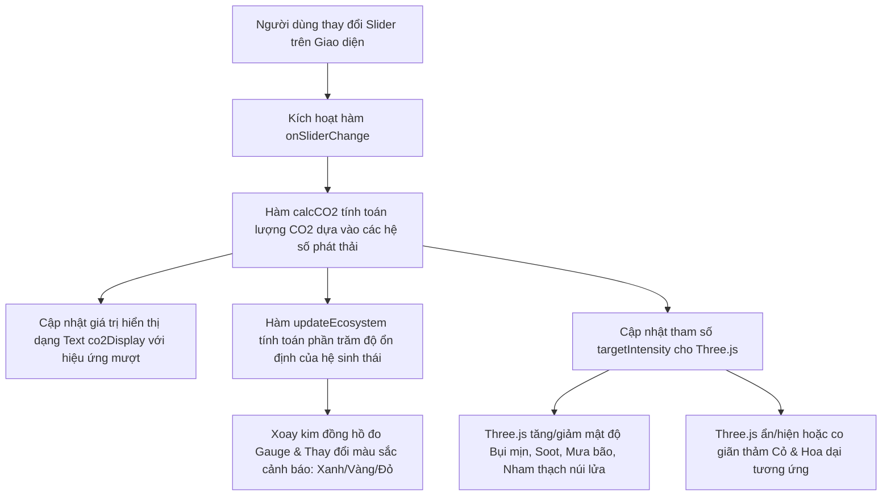
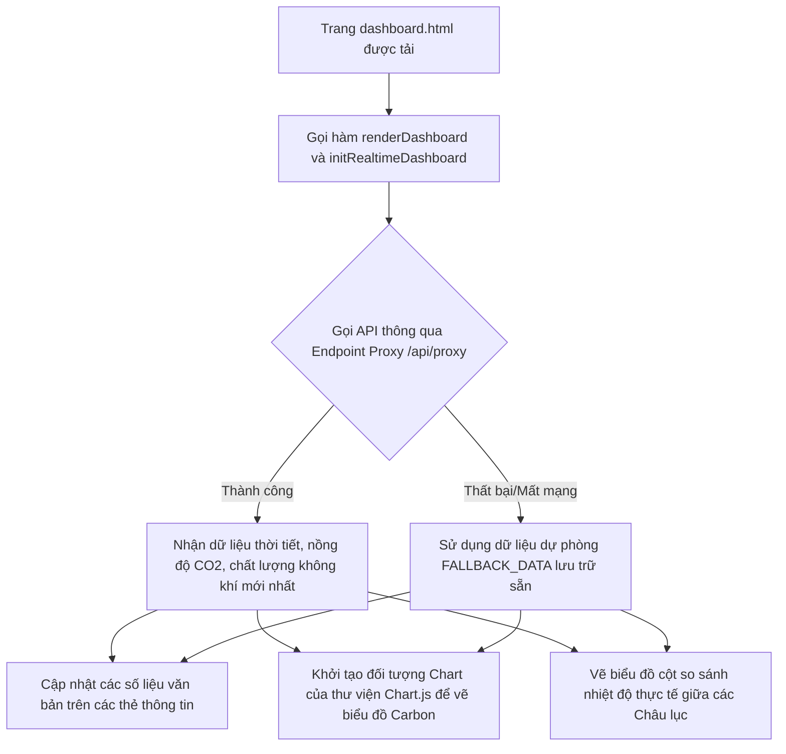

# 📘 CẨM NANG ÔN TẬP & TÓM TẮT MÃ NGUỒN ECOIMPACT HERO
> **Dành cho sinh viên chuẩn bị bảo vệ đồ án tốt nghiệp / đồ án môn học**
>
> Tài liệu này tóm tắt toàn bộ cấu trúc dự án, công nghệ cốt lõi, cơ chế tính toán, sơ đồ hoạt động và các câu hỏi phản biện thường gặp từ Hội đồng chấm thi giúp bạn nắm vững mã nguồn và tự tin đạt điểm cao.

---

## 🗺️ 1. TỔNG QUAN HỆ THỐNG & KIẾN TRÚC DỰ ÁN

### 1.1. Giới thiệu Đề tài
**EcoImpact Hero** là một nền tảng web tương tác cao, hướng tới mục tiêu nâng cao nhận thức cộng đồng về biến đổi khí hậu. Hệ thống cho phép:
1. **Tính toán dấu chân carbon** (Personal Carbon Footprint) dựa trên thói quen sống hàng ngày.
2. **Trực quan hóa tác động môi trường** bằng đồ họa 3D thời gian thực (Trái Đất biến đổi diện mạo dựa vào lượng khí thải carbon).
3. **Theo dõi dữ liệu khí hậu toàn cầu** thực tế thông qua các API quốc tế uy tín (Nồng độ CO2, Nhiệt độ trung bình, Chất lượng không khí AQI).
4. **Mô phỏng mạng xã hội học tập xanh** với Bảng xếp hạng đóng góp (Leaderboard) và Hệ thống Huy hiệu danh hiệu (Eco Badges).

---

### 1.2. Cấu trúc Thư mục và File trong Dự án

Dưới đây là sơ đồ vai trò của các file chính trong dự án:

| Tên File/Thư mục | Vai trò chuyên môn trong Đồ án |
| :--- | :--- |
| **`index.html`** | Trang chủ chính, giới thiệu sứ mệnh, số liệu tổng quan toàn cầu, lộ trình "Hành trình người hùng" và đăng ký nhận bản tin. |
| **`calculator.html`** | Trang công cụ tính toán Carbon. Chứa các Slider thói quen, giao diện hiển thị quả cầu 3D tương tác và xuất báo cáo phân tích (PDF Simulation). |
| **`dashboard.html`** | Bảng điều khiển trung tâm. Chứa biểu đồ lịch sử phát thải, biểu đồ nhiệt độ các châu lục thời gian thực, bảng xếp hạng và kho huy hiệu thành tích. |
| **`news.html`** | Trang tin tức khí hậu. Nhúng cổng thông tin môi trường Việt Nam qua Iframe giúp cập nhật tin tức trực tiếp. |
| **`community.html`** | Trang cộng đồng sống xanh, thúc đẩy người dùng tham gia các thử thách bảo vệ Trái Đất. |
| **`login.html`** / **`register.html`** | Giao diện đăng nhập, đăng ký tài khoản thành viên. |
| **`forgot-password.html`** | Giao diện khôi phục mật khẩu thông qua mã xác thực OTP (Mô phỏng). |
| **`app.js`** | File điều khiển logic chính của toàn bộ Frontend (ngoại trừ Auth). Quản lý lấy dữ liệu API toàn cầu, vẽ biểu đồ Chart.js, tính toán Carbon Footprint và tương tác Slider. |
| **`auth.js`** | File xử lý hệ thống xác thực mô phỏng (Mock Auth DB) bằng LocalStorage của trình duyệt. |
| **`js/bg3d.js`** | Kịch bản Three.js dựng cảnh nền 3D không gian vũ trụ, hiệu ứng bão táp, sấm chớp, mưa rơi và mô hình đồi núi sinh thái chuyển động mọc cỏ hoa dại. |
| **`styles.css`** | Chứa bộ mã nguồn CSS tùy biến, cấu trúc lưới Bento (Bento Grid), thiết kế kính mờ (Glassmorphic HUD) và các hiệu ứng chuyển động vi mô (Micro-animations). |
| **`serve.ps1`** | Server chạy môi trường phát triển cục bộ viết bằng PowerShell. Vừa là Web Server tĩnh, vừa làm **CORS Proxy** chuyển tiếp các yêu cầu API từ client để tránh lỗi bảo mật trình duyệt. |
| **`caytrangchu.glb`** / **`juan.glb`** | Các tài nguyên mô hình 3D (3D Models) định dạng nhị phân gLTF nén, dùng để dựng mô hình quả cầu sinh thái trong Three.js. |

---

## 💻 2. CÔNG NGHỆ CỐT LÕI & CÁCH THỨC VẬN HÀNH

### 2.1. Đồ họa 3D Tương tác (Three.js & WebGL)
Đây là điểm sáng công nghệ giúp đồ án của bạn **gây ấn tượng mạnh (WOW)** với Hội đồng chấm thi. Trong file [`js/bg3d.js`](file:///c:/Users/ACER/Downloads/CNW/bwd/js/bg3d.js) và [`calculator.html`](file:///c:/Users/ACER/Downloads/CNW/bwd/calculator.html):
* **Thiết lập Scene**: Khởi tạo Không gian (`THREE.Scene`), Camera góc rộng (`THREE.PerspectiveCamera`), và Bộ dựng hình (`THREE.WebGLRenderer`) hỗ trợ khử răng cưa `antialias: true` và chiếu bóng vật lý cao cấp (`ACESFilmicToneMapping`).
* **Ánh sáng Điện ảnh (Cinematic Lighting)**:
  * `AmbientLight`: Tạo nguồn sáng môi trường nền giữ chiều sâu các góc khuất bóng tối.
  * `HemisphereLight`: Giả lập ánh sáng khuếch tán từ bầu trời (Sky blue) hắt xuống mặt cỏ.
  * `DirectionalLight`: Đèn định hướng tạo luồng sáng chính chiếu bóng đổ sâu sắc (`shadowMap` độ phân giải 4096px).
  * `PointLight`: Đèn điểm phát quang lập lòe màu đỏ cam đặt ngay miệng núi lửa khi có khí thải CO2 cao.
* **Tải mô hình 3D**: Dùng thư viện `THREE.GLTFLoader` để tải tệp tin [`caytrangchu.glb`](file:///c:/Users/ACER/Downloads/CNW/bwd/caytrangchu.glb) hoặc [`juan.glb`](file:///c:/Users/ACER/Downloads/CNW/bwd/juan.glb). Đo chiều kích mô hình để co giãn (`scale`) và căn chỉnh tọa độ vào chính giữa màn hình một cách tự động.
* **Hệ thống hạt động (Dynamic Particle Systems)**: Dựng bằng `THREE.BufferGeometry` phối hợp với `THREE.PointsMaterial` để vẽ hàng ngàn hạt hiệu năng cao lơ lửng:
  * *Hạt mưa rơi*: Tạo quỹ đạo rơi chéo mô phỏng gió bão thổi dạt sang trái.
  * *Hạt bụi mịn PM2.5 & Tàn tro đen*: Bay hỗn loạn quanh quả cầu khi CO2 tăng cao để phản ánh ô nhiễm khí quyển.
  * *Sấm sét động*: Vẽ các đoạn thẳng zíc-zắc ngẫu nhiên bằng `THREE.Line` và thay đổi độ sáng đèn trời chớp nhoáng (Lightning Flash).
* **Thảm thực vật sinh trưởng thuật toán**:
  * Các lá cỏ dại (`grassGroup`) và hoa dại (`flowerGroup`) được nhân bản hàng ngàn bản thể. Đầu đỉnh của các lá cỏ được uốn cong theo công thức Parabol để tăng độ chân thực.
  * **Cơ chế phản ứng sinh thái**: Hệ thống liên tục lắng nghe lượng CO2 phát thải. Nếu CO2 ở mức an toàn (thấp), mã nguồn sẽ điều khiển mở rộng kích cỡ thảm cỏ/hoa (`scale.y` từ 0 tiến dần đến mức cực đại) tượng trưng cho việc phục hồi thiên nhiên. Nếu CO2 ở mức quá cao, cỏ hoa sẽ co lại ẩn đi, đồng thời kích hoạt bụi tro mù mịt và dòng nham thạch nóng chảy trên đồi núi.

---

### 2.2. Thuật toán Tính toán Phát thải Carbon (Carbon Calculator)
Nằm trong trang [`calculator.html`](file:///c:/Users/ACER/Downloads/CNW/bwd/calculator.html) và được điều khiển bởi hàm [`calcCO2()`](file:///c:/Users/ACER/Downloads/CNW/bwd/calculator.html#L1457-L1464).
Hệ thống sử dụng các hệ số phát thải thực tế theo tiêu chuẩn nghiên cứu môi trường toàn cầu:

$$\text{Tổng phát thải CO2 (kg/ngày)} = (t \times f_t) + (p \times f_p) + (e \times f_e) + (w \times f_w) + (d \times f_d)$$

**Trong đó các hệ số phát thải ($f$) được định nghĩa:**
1. **Di chuyển ($t$ - km/ngày)**: $f_t = 0.178$ (Trung bình lượng khí thải xe máy, ô tô cá nhân quy ra kg CO2 trên mỗi cây số).
2. **Đồ nhựa ($p$ - món dùng một lần/ngày)**: $f_p = 0.095$ (Lượng phát thải gián tiếp từ quá trình sản xuất và xử lý rác thải nhựa).
3. **Điện năng ($e$ - kWh/ngày)**: $f_e = 0.155$ (Hệ số phát thải của lưới điện hỗn hợp, dựa trên than đá, khí đốt và thủy điện).
4. **Rác sinh hoạt ($w$ - kg/ngày)**: $f_w = 0.850$ (Lượng khí methane và CO2 rò rỉ khi chôn lấp 1kg rác thải hữu cơ/vô cơ hỗn hợp).
5. **Bữa ăn thịt ($d$ - bữa ăn/ngày)**: $f_d = 1.150$ (Dấu chân carbon cực lớn của ngành chăn nuôi gia súc, đặc biệt là thịt bò, thịt lợn).

**Quy đổi giá trị sinh học hiển thị trên giao diện:**
* **Chỉ số sinh thái bù đắp (Carbon Offset)**: Quy đổi ước tính cây xanh hấp thụ carbon (1 cây hấp thụ trung bình khoảng 21kg CO2 mỗi năm, tương đương ~0.057kg CO2 mỗi ngày).
* **Công thức**: $c_{\text{cây cần trồng}} = \text{Ceil}\left(\frac{\text{Lượng CO2 hàng năm (CO2} \times 365)}{21}\right)$ cây.

---

### 2.3. Tích hợp Real-time API & CORS Proxy
Để hiển thị các con số sống động, trang Bảng điều khiển kết nối trực tiếp đến các cổng dữ liệu mở quốc tế:
1. **Dữ liệu nhiệt độ toàn cầu**: API từ `https://global-warming.org/api/temperature-api`.
2. **Nồng độ khí thải CO2 quyển khí**: API từ `https://global-warming.org/api/co2-api`.
3. **Chất lượng không khí (AQI & PM2.5 Hà Nội)**: API từ `https://air-quality-api.open-meteo.com` (tọa độ vĩ độ 21.02, kinh độ 105.83).
4. **Bản đồ nhiệt nhiệt độ các quốc gia**: API thông tin quốc gia `https://restcountries.com/v3.1/all` kết hợp lấy nhiệt độ thời tiết tức thời tại tọa độ thủ đô của họ.

#### Giải pháp kỹ thuật bypass CORS thông qua Server PowerShell Proxy:
Khi gọi trực tiếp các API trên bằng `fetch()` trong JavaScript ở trình duyệt, trình duyệt sẽ chặn yêu cầu do vi phạm chính sách chia sẻ tài nguyên nguồn gốc chéo (CORS).
Để giải quyết triệt để, đồ án thiết lập một proxy trung gian trong tệp tin [`serve.ps1`](file:///c:/Users/ACER/Downloads/CNW/bwd/serve.ps1):
* Client sẽ gửi yêu cầu tới endpoint nội bộ: `http://localhost:8000/api/proxy?url=[ĐƯỜNG_DẪN_API_THỰC_TẾ]`.
* Server PowerShell nhận yêu cầu, dùng lệnh `Invoke-WebRequest` đứng ra gọi API ở vai trò Backend (không bị hạn chế bởi CORS của trình duyệt).
* Sau đó, server ghi đè kết quả trả về cho Client. Đồng thời lưu trữ dữ liệu vào một biến bộ nhớ đệm `$global:apiCache` với thời gian sống (TTL) 300 giây giúp tránh việc gọi API quá nhiều lần làm chậm tốc độ load trang hoặc bị nhà cung cấp API chặn IP (Rate Limit).

---

### 2.4. Hệ thống Xác thực Thành viên mô phỏng (Mock Auth Engine)
Thay vì cài đặt các hệ quản trị cơ sở dữ liệu lớn (như MySQL, MongoDB) phức tạp không cần thiết cho một dự án tập trung vào trải nghiệm người dùng Front-End, đồ án thiết kế một cơ chế DB mô phỏng tại tệp tin [`auth.js`](file:///c:/Users/ACER/Downloads/CNW/bwd/auth.js):
* **Khóa dữ liệu**: `mock_users_v1` lưu trữ mảng các đối tượng User dưới dạng chuỗi JSON trong **LocalStorage** của trình duyệt.
* **Đăng ký**: Hàm `register()` kiểm tra tính hợp lệ của mật khẩu (tối thiểu 6 ký tự), kiểm tra trùng lặp email. Nếu đạt, đẩy đối tượng mới vào mảng LocalStorage.
* **Đăng nhập**: Hàm `login()` truy vấn LocalStorage tìm kiếm email khớp, đối chiếu mật khẩu trùng khớp, trả về trạng thái đăng nhập thành công và lưu thông tin người dùng hiện tại vào session `current_user`.
* **Lấy lại mật khẩu**: Mô phỏng gửi email bằng cách tạo ra mã OTP `123456` ngẫu nhiên có thời gian hết hạn sau 10 phút, in trực tiếp ra bảng thông báo giao diện nhà phát triển giúp dễ dàng kiểm thử.

---

## 📊 3. SƠ ĐỒ LUỒNG HOẠT ĐỘNG CHÍNH (FLOWCHARTS)

### 3.1. Luồng xử lý dữ liệu của Máy tính Carbon & Phản hồi 3D

### 3.2. Luồng xử lý Bảng điều khiển (Dashboard Data Flow)

---

## 🎓 4. BỘ CÂU HỎI PHẢN BIỆN BẢO VỆ ĐỒ ÁN (FAQ)
*Dưới đây là các câu hỏi thầy cô trong Hội đồng chấm thi rất hay hỏi và gợi ý cách trả lời thông minh để ghi điểm:*

### ❓ Câu 1: Em hãy giải thích cơ chế bypass lỗi CORS trong đồ án này? Tại sao gọi API trực tiếp từ JS bị lỗi nhưng chạy qua proxy lại được?
> **💡 Trả lời:**
> "CORS (Cross-Origin Resource Sharing) là một cơ chế bảo mật của trình duyệt ngăn chặn mã JavaScript từ một nguồn trang web này gửi yêu cầu lấy tài nguyên từ một nguồn trang web khác nếu máy chủ nguồn đó không cho phép (không trả về Header `Access-Control-Allow-Origin`). 
> Để khắc phục, em đã tự xây dựng một **CORS Proxy** tích hợp ngay bên trong file server chạy nền bằng PowerShell [`serve.ps1`](file:///c:/Users/ACER/Downloads/CNW/bwd/serve.ps1). Nguyên lý là trình duyệt chỉ chặn CORS đối với Client-Side JavaScript (mã chạy trên browser của người dùng), còn các yêu cầu gọi dữ liệu từ phía Máy chủ (Server-Side) thì hoàn toàn không bị hạn chế bởi CORS. Client của trang web sẽ gửi yêu cầu lên endpoint `/api/proxy` của server nội bộ của em, sau đó máy chủ PowerShell của em sẽ đóng vai trò trung gian tải dữ liệu đó về và chuyển tiếp lại cho Client. Nhờ đó trình duyệt không hề phát hiện ra hành vi gọi tài nguyên chéo nguồn gốc và loại bỏ hoàn toàn lỗi CORS."

### ❓ Câu 2: Em hãy trình bày công thức tính toán lượng phát thải CO2 trong phần Calculator? Dữ liệu các hệ số này lấy từ đâu và có đáng tin cậy không?
> **💡 Trả lời:**
> "Công thức tính toán được em thiết lập tại hàm `calcCO2()` trong trang [`calculator.html`](file:///c:/Users/ACER/Downloads/CNW/bwd/calculator.html#L1457-L1464). Lượng phát thải hàng ngày của cá nhân được tổng hợp từ 5 hoạt động cốt lõi: Di chuyển, Tiêu thụ nhựa dùng 1 lần, Lượng điện tiêu thụ gia đình, Khối lượng rác thải sinh hoạt phát sinh và Số bữa ăn có chứa thịt động vật.
> Các hệ số nhân của các hoạt động này được tham khảo từ các nghiên cứu uy tín quốc tế, ví dụ: Hệ số điện lưới `0.155` kg CO2/kWh được tham chiếu từ cơ sở dữ liệu của Tổ chức Năng lượng Quốc tế (IEA); Hệ số di chuyển `0.178` kg CO2/km dựa trên chỉ số phát thải xe cá nhân trung bình của cơ quan EPA Mỹ; hệ số rác thải chôn lấp và chăn nuôi lấy từ báo cáo của IPCC. Do đó, các con số ước tính này mang tính khoa học cao và phản ánh tương đối chính xác hành vi sinh hoạt thực tế của người dùng."

### ❓ Câu 3: Làm thế nào để Three.js cập nhật diện mạo của Trái Đất (như mọc cỏ, bão táp, bụi tro) theo thời gian thực khi người dùng kéo thanh trượt?
> **💡 Trả lời:**
> "Trong mã nguồn, em thiết lập sự kiện lắng nghe sự thay đổi của người dùng thông qua thuộc tính `oninput` trên các thẻ Slider. Khi người dùng kéo thanh trượt, sự kiện này kích hoạt hàm `onSliderChange()`. Hàm này không chỉ tính toán lại CO2 mà còn tính ra một tỷ lệ phần trăm ô nhiễm từ `0.0` (môi trường lý tưởng tuyệt đối) đến `1.0` (môi trường ô nhiễm nặng nề) và lưu vào biến `targetIntensity`.
> Trong vòng lặp kết xuất đồ họa chính của Three.js (hàm `animate` chạy liên tục ~60 khung hình/giây), giá trị cường độ ô nhiễm thực tế của đồ họa (`orbIntensity`) sẽ liên tục tịnh tiến mượt mà về phía giá trị mục tiêu `targetIntensity`. Khi độ ô nhiễm tăng lên:
> 1. Chất liệu sương mù của không gian 3D (`scene.fog.density`) tăng mật độ tạo bầu không khí ngột ngạt.
> 2. Các hạt bụi tro và bụi mịn sẽ tăng độ đục (`opacity.value`) làm hiện rõ các lớp bụi bẩn bao quanh hành tinh.
> 3. Hiệu ứng nham thạch nóng chảy ở chân đồi đồi núi và các đốm lửa phun trào sẽ tăng độ sáng và kích hoạt ánh sáng đỏ cam rực lên.
> 4. Ngược lại, thảm cỏ xanh và hoa dại được quản lý bởi `grassGroup` và `flowerGroup` sẽ tự động thực hiện phép co giãn chiều cao `scale.y` về mức 0 để tượng trưng cho việc thực vật bị khô héo, hủy diệt."

### ❓ Câu 4: Đồ án của em lưu trữ thông tin tài khoản người dùng ở đâu? Nếu tắt trình duyệt thì thông tin đăng nhập còn giữ được không?
> **💡 Trả lời:**
> "Hệ thống xác thực thành viên của đồ án hiện tại đang sử dụng bộ nhớ **LocalStorage** của trình duyệt web thông qua thư viện xác thực tự viết [`auth.js`](file:///c:/Users/ACER/Downloads/CNW/bwd/auth.js). 
> LocalStorage lưu trữ dữ liệu dưới dạng khóa-giá trị (Key-Value) trực tiếp trên ổ cứng thiết bị của người dùng và dữ liệu này **không có ngày hết hạn**, nghĩa là khi người dùng tắt trình duyệt, khởi động lại máy tính, thông tin tài khoản đã đăng ký (khóa `mock_users_v1`) và phiên đăng nhập hiện tại (khóa `current_user`) vẫn sẽ được bảo toàn nguyên vẹn. Chỉ khi người dùng bấm nút đăng xuất (Logout) làm kích hoạt lệnh `localStorage.removeItem('current_user')` hoặc tiến hành xóa dữ liệu duyệt web thì thông tin mới bị mất đi."

### ❓ Câu 5: Em hãy chỉ ra điểm nổi bật nhất về mặt thiết kế giao diện (UI/UX) của đồ án này?
> **💡 Trả lời:**
> "Điểm nổi bật nhất về mặt thiết kế của đồ án là ứng dụng phong cách **Glassmorphism (Kính mờ)** kết hợp với phong cách giao diện tương lai **Sci-Fi HUD (Heads-Up Display)**.
> 1. **Hiệu ứng Kính mờ**: Sử dụng lớp phủ nền bán trong suốt kết hợp thuộc tính `backdrop-filter: blur(24px)` giúp các khung thẻ nội dung hiển thị sang trọng, nổi bật trên nền hoạt ảnh 3D chuyển động mà không gây rối mắt cho người xem.
> 2. **Phong cách HUD & Cyber**: Dựng các đường kẻ định vị radar, các khung viền công nghệ cao ở 4 góc thẻ (`hud-corner`) tạo cảm giác như người dùng đang quan sát Trái Đất qua kính viễn vọng của một trung tâm điều khiển hiện đại.
> 3. **Trải nghiệm UX mượt mà**: Toàn bộ các con số đếm tăng dần (Counter), biểu đồ chuyển động (Animated Charts), hiệu ứng sấm chớp lập lòe ngẫu nhiên và việc các lá cỏ đung đưa theo làn gió ảo đều sử dụng các hoạt ảnh vi mô (Micro-animations) giúp hệ sinh thái số của trang web có cảm giác như đang sống và phản hồi tự nhiên với hành vi của con người."

---

## 🛠️ 5. GỢI Ý CÁC BƯỚC ĐỂ BÁO CÁO ĐỒ ÁN THÀNH CÔNG
1. **Chuẩn bị môi trường**: 
   * Mở PowerShell trong thư mục dự án và chạy tệp tin lệnh [`serve.ps1`](file:///c:/Users/ACER/Downloads/CNW/bwd/serve.ps1) bằng câu lệnh: `.\serve.ps1`.
   * Mở trình duyệt truy cập `http://localhost:8000/`.
2. **Kịch bản Demo ấn tượng**:
   * **Bắt đầu bằng Trang chủ**: Chỉ vào quả cầu 3D đang tự quay mượt mà ở phía nền và phần biểu đồ CO2 dao động trực tiếp.
   * **Chuyển sang trang Calculator**: Kéo các thanh trượt từ mức tối thiểu lên tối đa. Hãy hướng sự chú ý của thầy cô vào quả cầu 3D để thầy cô thấy quả cầu chuyển đổi từ một ngọn đồi cỏ xanh ngắt sang một bối cảnh bão táp mịt mù khói bụi, nham thạch phun trào. Bấm xuất báo cáo carbon để thấy giao diện gợi ý hành động xanh.
   * **Chuyển sang trang Dashboard**: Chỉ ra các biểu đồ Chart.js trực quan hóa dữ liệu CO2 thật từ API và bảng xếp hạng, huy hiệu thành tích độc đáo.
   * **Trình bày phần đăng nhập/đăng ký**: Thực hiện đăng ký tài khoản mới, sau đó đăng nhập thành công để thấy tên tài khoản xuất hiện trên thanh Navbar thay thế nút đăng nhập cũ.

---
*Chúc các bạn ôn tập tốt và đạt kết quả xuất sắc trong buổi bảo vệ đồ án!*
